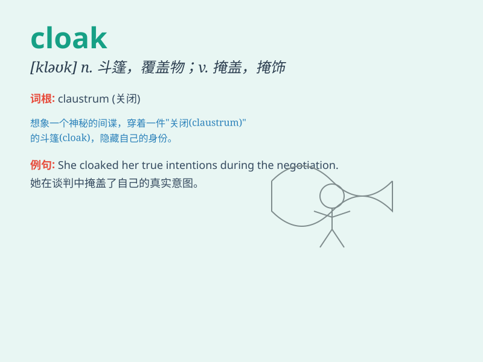

## cloak

**英音:** _[kləʊk]_ **美音:** _[klok]_

**译义:** *n.斗蓬,宽大外衣,掩护vt.用外衣遮蔽,披斗篷*

### 短语

+ **cloak room:** _衣帽间；寄物处_

+ **under the cloak of:** _在\...\...的掩盖下_

+ **cloak and dagger:** _秘密的；阴谋的_

+ **throw off one\'s cloak:** _露出真面目；不再伪装_

+ **a cloak of secrecy:** _一层神秘的面纱_

### 例句

#### 例句1

> **The magician used a cloak to hide the rabbit.**

**中文翻译:** 魔术师用斗篷把兔子藏起来。

**单词释义:** 斗篷

#### 例句2

> **His kindness was just a cloak for his true intentions.**

**中文翻译:** 他的善良只是他真实意图的幌子。

**单词释义:** 掩盖；幌子

#### 例句3

> **The fog cloaked the city in mystery.**

**中文翻译:** 浓雾给这座城市蒙上一层神秘的色彩。

**单词释义:** 笼罩；覆盖

### 背诵小故事

> A spy needed to hide. He put on a special cloak that made him blend
into the shadows. With the cloak, no one could see him. It was like a
magic shield that kept him safe and unseen.

**一个间谍需要隐藏。他穿上了一件特殊的斗篷，使他融入了阴影之中。有了这件斗篷，没人能看见他。它就像一个神奇的盾牌，让他安全且不被发现。**

### 图义

