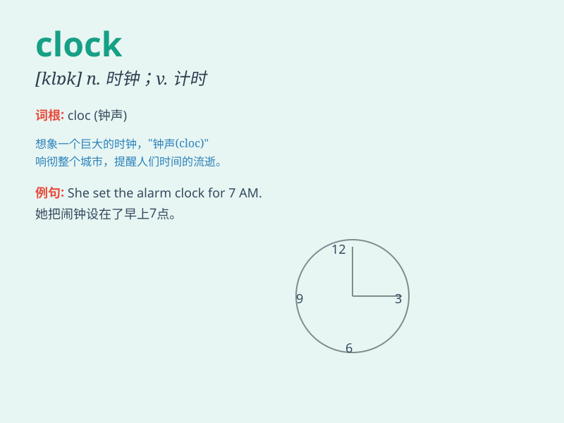

## clock

**英音:** _[klɒk]_ **美音:** _[klɑk]_

**译义:** *n.时钟*

### 短语

+ **alarm clock:** _闹钟_

+ **clock tower:** _钟楼_

+ **wall clock:** _挂钟_

+ **clock in:** _打卡上班_

+ **clock out:** _打卡下班_

### 例句

#### 例句1

> **The clock on the wall shows it\'s eight o\'clock.**

**中文翻译:** 墙上的时钟显示已经八点了。

**单词释义:** 钟

#### 例句2

> **He clocked ten miles on his morning run.**

**中文翻译:** 他晨跑跑了十英里。

**单词释义:** 记录（速度、里程等）

#### 例句3

> **She clocked in at 9 a.m. and clocked out at 5 p.m.**

**中文翻译:** 她早上九点上班，下午五点下班。

**单词释义:** 打卡；记录上班/下班时间

### 背诵小故事

> One day, a little mouse was running around the room. Suddenly, it saw
a big clock on the wall. The clock\'s hands were moving steadily, as if
telling the mouse that time was passing. The mouse was amazed by the
clock.

**有一天，一只小老鼠在房间里跑来跑去。突然，它看到墙上有一个大钟。钟的指针稳定地移动着，仿佛在告诉老鼠时间在流逝。老鼠对这个钟感到很惊奇。**

### 图义

