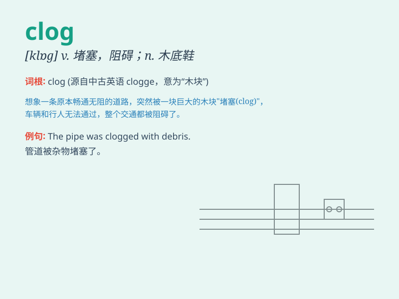

## clog

**英音:** _[klɒg]_ **美音:** _[klɑg]_

**译义:** *n.木底鞋,障碍v.障碍,阻塞*

### 短语

+ **clog up:** _堵塞；塞住_

+ **clog with:** _被......堵塞_

+ **wooden clog:** _木屐_

+ **clog dance:** _木屐舞_

+ **clog the wheels:** _阻碍轮子转动；阻碍进展_

### 例句

#### 例句1

> **The drain was clogged with hair.**

**中文翻译:** 下水道被头发堵住了。

**单词释义:** 堵塞

#### 例句2

> **Heavy traffic clogged the roads during rush hour.**

**中文翻译:** 高峰时段交通拥挤，道路堵塞。

**单词释义:** 阻塞

#### 例句3

> **His mind was clogged with worries.**

**中文翻译:** 他的脑子里充满了忧虑。

**单词释义:** 充满，塞满

### 背诵小故事

>
想象一下，一只调皮的小猫在厨房玩耍，不小心把很多木块掉进了下水道，结果下水道被木块堵住（clog）了，水流不下去。

**想象一只小猫把木块掉进下水道导致堵塞的情景来记忆'clog（堵塞、阻塞）'这个单词。**

### 图义

