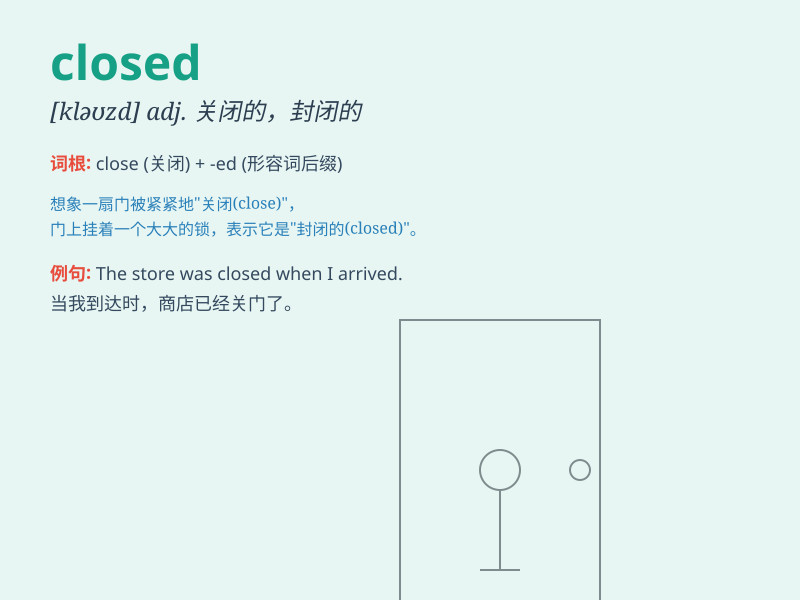

## closed

**英音:** _[kləʊzd]_ **美音:** _[klozd]_

**译义:** *adj.关闭的,限于少数人的*

### 短语

+ **closed circuit:** _闭路；闭合电路_

+ **closed system:** _封闭系统_

+ **closed book:** _完全不懂的学科；一无所知的事物_

+ **closed door:** _关闭的门；不公开的；秘密的_

+ **closed shop:** _只雇用工会会员的工厂（或商店等）_

### 例句

#### 例句1

> **The shop is closed on Sundays.**

**中文翻译:** 商店周日不营业。

**单词释义:** 关闭的；不营业的

#### 例句2

> **She has closed her heart to love.**

**中文翻译:** 她对爱情关闭了心门。

**单词释义:** 关闭；封闭

#### 例句3

> **The road was closed due to construction.**

**中文翻译:** 该道路因施工而封闭。

**单词释义:** 封闭的；封锁的

### 背诵小故事

> One day, Tom wanted to enter a store, but the door was closed. He
knocked and waited, but no one opened it. Finally, he realized it was
not the right time. Poor Tom!

**有一天，汤姆想要进入一家商店，但门是关着的。他敲门并等待，但没人开门。最后，他意识到不是合适的时间。可怜的汤姆！**

### 图义

