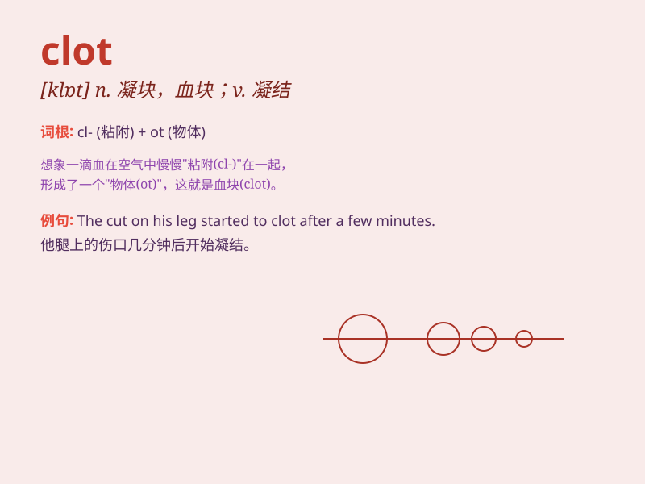

## clot

**英音:** _[klɒt]_ **美音:** _[klɑt]_

**译义:** *n.(血液等的)凝块v.(使)凝结*

### 短语

+ **blood clot:** _血块_

+ **clot formation:** _凝块形成_

+ **clotting factor:** _凝血因子_

+ **clot thicken:** _凝块变厚_

+ **clot dissolve:** _凝块溶解_

### 例句

#### 例句1

> **A blood clot can cause a stroke.**

**中文翻译:** 血栓可能导致中风。

**单词释义:** 凝块；血块

#### 例句2

> **The cream began to clot as it cooled.**

**中文翻译:** 奶油冷却后开始凝结。

**单词释义:** 使凝结；使结块

#### 例句3

> **The thick fog seemed to clot the air.**

**中文翻译:** 浓浓的雾气似乎凝结了空气。

**单词释义:** 使变得呆滞；使凝结

### 背诵小故事

> A brave knight was injured in a battle. His blood started to clot and
form a thick mass, stopping the bleeding and saving his life. The clot
became a symbol of his survival and strength.

**一位勇敢的骑士在战斗中受伤了。他的血液开始凝结，形成厚厚的团块，止住了流血，救了他的命。凝结的血块成了他生存和力量的象征。**

### 图义

