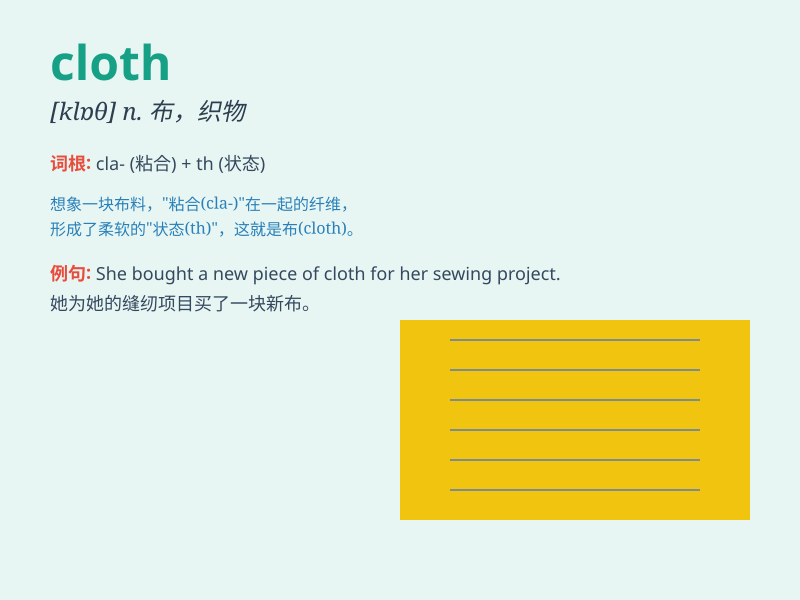

## cloth

**英音:** _[klɒθ]_ **美音:** _[klɔθ]_

**译义:** *n.布,织物,衣料*

### 短语

+ **cloth bag:** _布袋_

+ **cloth shoes:** _布鞋_

+ **table cloth:** _桌布_

+ **cloth merchant:** _布商_

+ **cloth factory:** _布厂_

### 例句

#### 例句1

> **She wiped the table with a damp cloth.**

**中文翻译:** 她用湿布擦桌子。

**单词释义:** 布；织物

#### 例句2

> **This piece of cloth is long enough for a dress.**

**中文翻译:** 这块布足够长，可以做一件衣服。

**单词释义:** 布；布料

#### 例句3

> **He bought some black cloth to make curtains.**

**中文翻译:** 他买了一些黑布来做窗帘。

**单词释义:** 布；布料

### 背诵小故事

> One day, a little girl needed a new dress. Her mother took out a
beautiful piece of cloth and started sewing. With the magic of the
cloth, a lovely dress was made. The girl was so happy!

**有一天，一个小女孩需要一件新裙子。她的妈妈拿出一块漂亮的布然后开始缝纫。凭借这块神奇的布，一件可爱的裙子做好了。小女孩非常开心！**

### 图义

