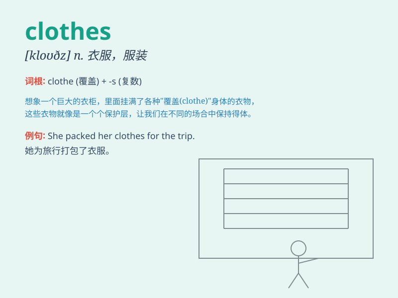

## clothes

**英音:** _[kləʊ(ð)z]_ **美音:** _[kloz]_

**译义:** *n.衣服,[总称]被褥,各种衣服,\<美俚>家丑*

### 短语

+ **clothes rack:** _衣架_

+ **clothes peg:** _晾衣夹_

+ **clothes brush:** _衣刷_

+ **clothes horse:** _晾衣架；爱打扮的人_

+ **clothes moths:** _衣蛾_

### 例句

#### 例句1

> **She has a lot of beautiful clothes in her closet.**

**中文翻译:** 她的衣橱里有很多漂亮的衣服。

**单词释义:** 衣服（常用复数）

#### 例句2

> **These clothes are too small for me.**

**中文翻译:** 这些衣服对我来说太小了。

**单词释义:** 衣服（常用复数）

#### 例句3

> **He always wears casual clothes to work.**

**中文翻译:** 他总是穿着休闲服去上班。

**单词释义:** 衣服（常用复数）

### 背诵小故事

> One day, a little girl opened her closet and saw a mess of clothes.
She had to sort them out. Shirts, pants, dresses - all these clothes
needed to be organized neatly. Finally, she did it and felt very happy.

**有一天，一个小女孩打开她的衣柜，看到一堆乱糟糟的衣服。她不得不把它们整理出来。衬衫、裤子、连衣裙------所有这些衣服都需要整齐地整理好。最后，她做到了，感到非常开心。**

### 图义

