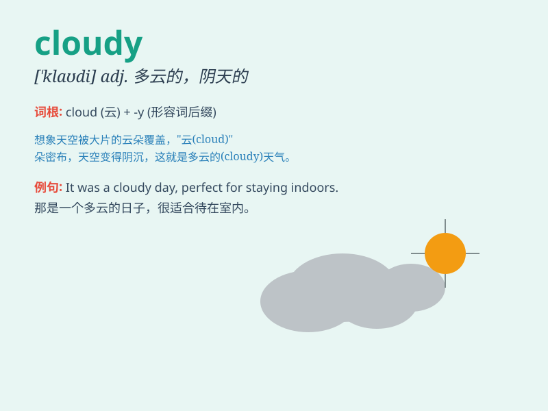

## cloudy

**英音:** _[\'klaʊdɪ]_ **美音:** _[\'klaʊdi]_

**译义:** *adj.多云的,阴天的,阴沉*

### 短语

+ **cloudy sky:** _多云的天空_

+ **cloudy day:** _阴天_

+ **cloudy weather:** _多云的天气_

+ **become cloudy:** _变得多云_

+ **a little cloudy:** _有点多云_

### 例句

#### 例句1

> **It\'s cloudy today. We might not be able to go for a picnic.**

**中文翻译:** 今天多云。我们可能无法去野餐。

**单词释义:** 阴天的；多云的

#### 例句2

> **The sky looks cloudy. It seems like it\'s going to rain.**

**中文翻译:** 天空看起来多云。看来要下雨了。

**单词释义:** 多云的

#### 例句3

> **After the storm, the weather remained cloudy for several
days.**

**中文翻译:** 暴风雨过后，天气持续多云多日。

**单词释义:** 多云的；阴天的

### 背诵小故事

> One day, Tom went for a picnic. But the sky became cloudy very
quickly. It looked like it was going to rain. Poor Tom had to pack up
and go home. \'Cloudy\' means the sky is covered with clouds.

**有一天，汤姆去野餐。但天空很快就变得多云了。看起来要下雨了。可怜的汤姆不得不收拾东西回家。'cloudy'意思是天空布满了云。**

### 图义

