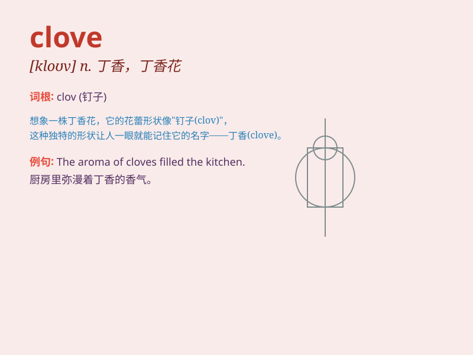

## clove

**英音:** _[kləʊv]_ **美音:** _[klov]_

**译义:** *n.[植]丁香 vbl.cleave 的过去式*

### 短语

+ **clove hitch:** _卷结；酒瓶结_

+ **clove oil:** _丁香油_

+ **clove cigarette:** _丁香香烟_

+ **clove of garlic:** _一瓣大蒜_

+ **clove pink:** _香石竹；康乃馨_

### 例句

#### 例句1

> **She added a few cloves of garlic to the dish for flavor.**

**中文翻译:** 她在菜里加了几瓣大蒜来调味。

**单词释义:** 丁香；蒜瓣

#### 例句2

> **The smell of cloves filled the room.**

**中文翻译:** 房间里充满了丁香的气味。

**单词释义:** 丁香

#### 例句3

> **He chewed on a clove to relieve his toothache.**

**中文翻译:** 他咀嚼丁香来缓解牙痛。

**单词释义:** 丁香

### 背诵小故事

> A girl named Clove loved climbing trees. One day, she found a special
flower bud on a branch. She didn\'t know it was a clove. But she was
amazed by its smell. Later, she learned it was called a clove.

**一个叫克洛芙（Clove）的女孩喜欢爬树。有一天，她在一根树枝上发现了一个特别的花芽。她不知道这是丁香花苞。但她被它的气味所吸引。后来，她才知道这叫丁香花苞，也就是
clove 。**

### 图义

