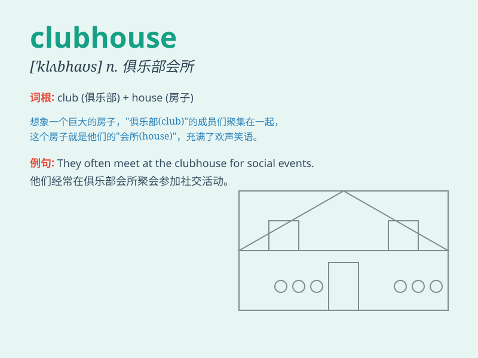

## clubhouse

**英音:** _[\'klʌbhaʊs]_ **美音:** _[\'klʌb\'haʊs]_

**译义:** *n.俱乐部会所*

### 短语

+ **private clubhouse:** _私人会所_

+ **sports clubhouse:** _体育俱乐部会所_

+ **community clubhouse:** _社区会所_

+ **luxurious clubhouse:** _豪华会所_

+ **members-only clubhouse:** _会员专属会所_

### 例句

#### 例句1

> **The clubhouse is a great place to socialize with friends.**

**中文翻译:** 这个俱乐部会所是和朋友们社交的好地方。

**单词释义:** 俱乐部会所

#### 例句2

> **We decorated the clubhouse for the party.**

**中文翻译:** 我们为聚会装饰了俱乐部会所。

**单词释义:** 俱乐部会所

#### 例句3

> **The children love playing in the clubhouse after school.**

**中文翻译:** 孩子们放学后喜欢在俱乐部会所里玩耍。

**单词释义:** 俱乐部会所

### 背诵小故事

> A group of friends decided to build a clubhouse in an old tree. They
spent weekends working together, making it a special place to play and
share secrets. The clubhouse became their favorite spot.

**一群朋友决定在一棵老树上建造一个俱乐部活动室。他们在周末一起工作，把它变成了一个玩耍和分享秘密的特别地方。这个俱乐部活动室成了他们最喜欢的场所。**

### 图义

