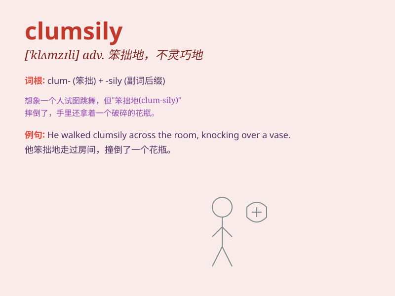

## clumsily

**英音:** _[\'klʌmzɪli]_ **美音:** _[\'klʌmzɪli]_

**译义:** *adv.笨拙地,粗陋地,不漂亮地*

### 短语

+ **move clumsily:** _笨拙地移动_

+ **write clumsily:** _书写笨拙_

+ **speak clumsily:** _说话不利索_

+ **act clumsily:** _行动笨拙_

+ **handle clumsily:** _笨拙地处理_

### 例句

#### 例句1

> **He walked clumsily across the room, tripping over the rug.**

**中文翻译:** 他笨拙地穿过房间，被地毯绊倒了。

**单词释义:** 笨拙地

#### 例句2

> **She danced clumsily, out of step with the music.**

**中文翻译:** 她跳舞很笨拙，跟不上音乐的节拍。

**单词释义:** 笨拙地

#### 例句3

> **The new employee handled the equipment clumsily, causing some
damage.**

**中文翻译:** 新员工笨拙地操作设备，造成了一些损坏。

**单词释义:** 笨拙地

### 背诵小故事

> A clumsily monkey tried to climb a tall tree. It kept slipping and
falling because it moved in a clumsy way. Finally, it gave up and sat on
the ground, looking very funny.

**一只笨手笨脚的猴子试图爬上一棵高大的树。它不停地滑倒和跌落，因为它的动作很笨拙。最后，它放弃了，坐在地上，看起来十分滑稽。**

### 图义

