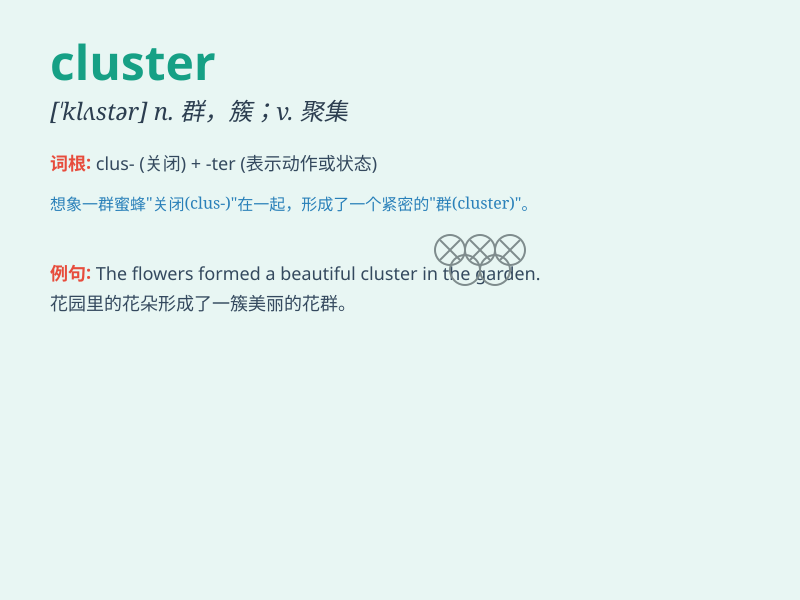

## cluster

**英音:** _[\'klʌstə]_ **美音:** _[\'klʌstɚ]_

**译义:** *n.串,丛;vi.丛生,成群*

### 短语

+ **cluster bomb:** _集束炸弹_

+ **cluster headache:** _丛集性头痛_

+ **star cluster:** _星团_

+ **a cluster of:** _一群；一组；一串_

+ **cluster together:** _聚集在一起_

### 例句

#### 例句1

> **The students clustered around the teacher to ask questions.**

**中文翻译:** 学生们聚集在老师周围提问。

**单词释义:** 聚集

#### 例句2

> **A cluster of stars can be seen in the night sky.**

**中文翻译:** 在夜空中可以看到一群星星。

**单词释义:** 群；簇

#### 例句3

> **The grapes were growing in clusters on the vine.**

**中文翻译:** 葡萄成串地长在葡萄藤上。

**单词释义:** 串；束

### 背诵小故事

> Imagine a bunch of colorful balloons tied closely together. They form
a cluster. Just like a group of stars in the sky or a group of flowers
in a garden, they are a cluster.

**想象一堆五颜六色的气球紧紧系在一起。它们形成了一簇。就像天空中的一群星星或花园里的一群花，它们就是一簇。**

### 图义

