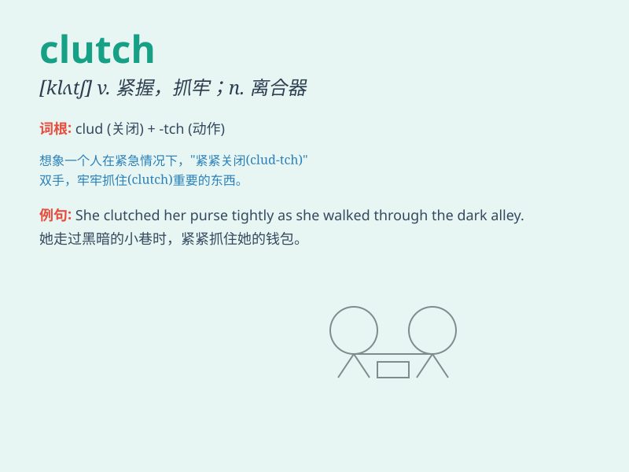

## clutch

**英音:** _[klʌtʃ]_ **美音:** _[klʌtʃ]_

**译义:** *v.抓住,攫住n.离合器*

### 短语

+ **clutch at:** _企图抓住；尽力抓住_

+ **in the clutch:** _在关键时刻；在紧急关头_

+ **clutch bag:** _女用无带提包_

+ **clutch pedal:** _离合器踏板_

+ **clutch plate:** _离合器片_

### 例句

#### 例句1

> **He clutched the rope tightly as he climbed up the cliff.**

**中文翻译:** 他爬悬崖时紧紧抓住绳子。

**单词释义:** 抓住

#### 例句2

> **The woman clutched her bag to her chest.**

**中文翻译:** 那个女人把包紧紧抱在胸前。

**单词释义:** 紧握

#### 例句3

> **In the final moments, the team made a clutch play and won the
game.**

**中文翻译:** 在最后时刻，球队打出了关键的一着并赢得了比赛。

**单词释义:** 关键的

### 背诵小故事

> A brave climber was trying to reach the top of the mountain. His
hands were in a clutch, tightly grasping the rocks. Just when he thought
he might fall, he held on and finally made it. The clutch of his hands
saved him.

**一位勇敢的登山者试图登顶。他的手紧紧抓着，处于紧握状态。就在他以为自己可能会掉落时，他坚持住了，最终成功。他双手的紧握救了他。**

### 图义

