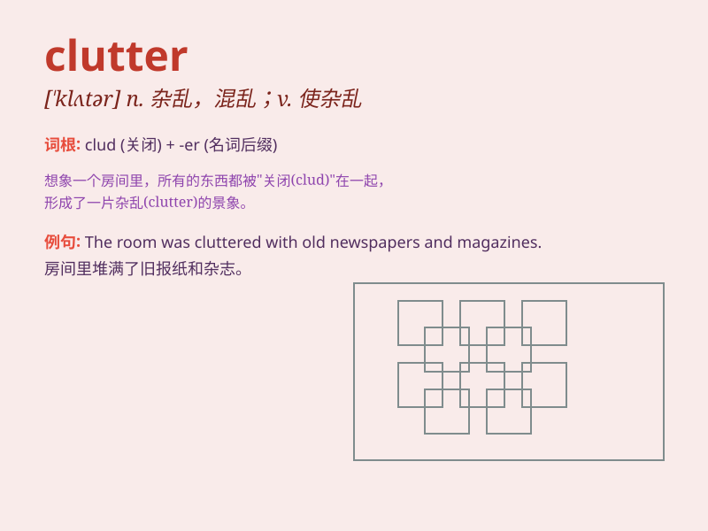

## clutter

**英音:** _[\'klʌtə]_ **美音:** _[\'klʌtɚ]_

**译义:** *n.混乱*

### 短语

+ **clutter up:** _使杂乱；使凌乱_

+ **mental clutter:** _精神上的混乱_

+ **clutter with:** _用......堆满；使杂乱_

+ **desk clutter:** _书桌的杂乱_

+ **room clutter:** _房间的杂乱_

### 例句

#### 例句1

> **The room was filled with clutter.**

**中文翻译:** 这个房间堆满了杂物。

**单词释义:** 杂物

#### 例句2

> **She spent the weekend clearing the clutter from her closet.**

**中文翻译:** 她周末花时间清理了衣柜里的杂乱物品。

**单词释义:** 杂乱物品

#### 例句3

> **His desk was a clutter of papers and books.**

**中文翻译:** 他的书桌堆满了文件和书籍，杂乱不堪。

**单词释义:** 杂乱

### 背诵小故事

> One day, Tom\'s room was in a clutter. There were books everywhere,
clothes on the floor, and toys all over. His mom said, \'Clean this
clutter!\' Tom then spent hours tidying up.

**一天，汤姆的房间非常杂乱。到处都是书，衣服在地板上，玩具也到处都是。他妈妈说：'把这堆杂乱清理干净！'
然后汤姆花了几个小时来整理。**

### 图义

