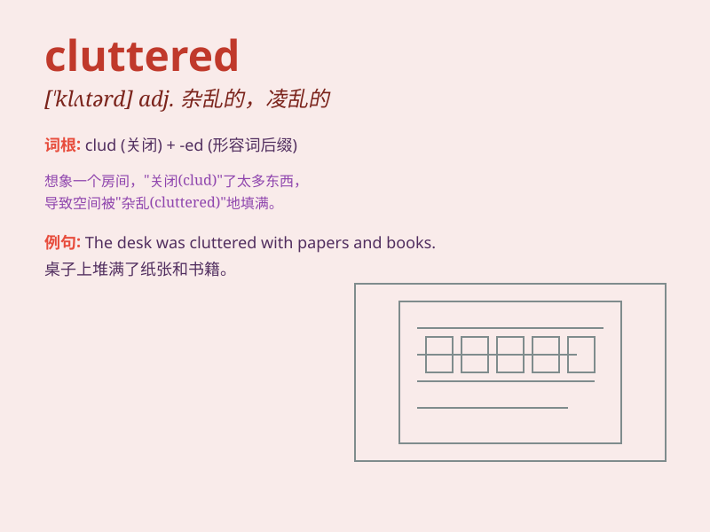

## cluttered

**英音:** _[ˈklʌtəd]_ **美音:** _[ˈklʌtərd]_

**译义:** *adj. 杂乱的，凌乱的；堆满的*

### 短语

+ **cluttered room:** _杂乱的房间_

+ **cluttered desk:** _凌乱的书桌_

+ **cluttered mind:** _混乱的思绪_

+ **cluttered closet:** _拥挤的衣橱_

+ **cluttered attic:** _堆满杂物的阁楼_

### 例句

#### 例句1

> **The room was cluttered with toys and books.**

**中文翻译:** 这个房间里堆满了玩具和书籍。

**单词释义:** 堆满；杂乱

#### 例句2

> **Her desk was cluttered with papers and pens.**

**中文翻译:** 她的书桌被纸张和笔弄得杂乱不堪。

**单词释义:** 使杂乱；混乱地堆满

#### 例句3

> **The closet was so cluttered that I couldn\'t find what I
needed.**

**中文翻译:** 衣柜太杂乱了，我找不到我需要的东西。

**单词释义:** 凌乱；杂乱无章

### 背诵小故事

> One day, I entered a room that was cluttered with toys and books
everywhere. I had to spend a lot of time cleaning it up. It was a messy
and chaotic scene.

**有一天，我走进一个房间，里面到处都杂乱地堆满了玩具和书籍。我不得不花很多时间来清理。那是一片凌乱又混乱的景象。**

### 图义

