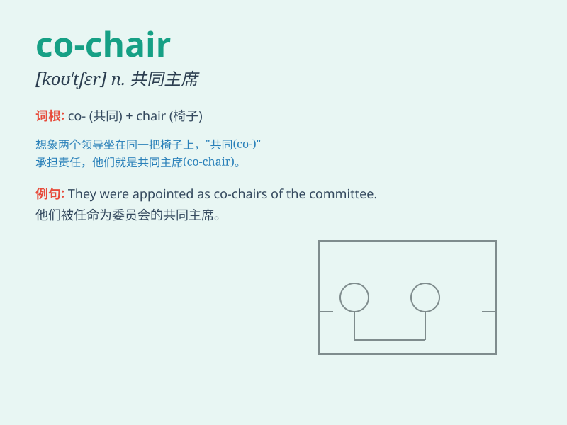

## co-chair

**英音:** _[ˌkəʊˈtʃɛə]_ **美音:** _[ˌkoʊˈtʃer]_

**译义:** *n. 联合主席；共同主持人*

### 短语

+ **co-chairperson:** _联合主席；共同主席_

+ **co-chair committee:** _联合主持委员会_

+ **co-chair meeting:** _共同主持会议_

+ **co-chair event:** _联合主持活动_

+ **co-chair session:** _共同主持会议环节_

### 例句

#### 例句1

> **She will co-chair the meeting with him.**

**中文翻译:** 她将和他共同主持这次会议。

**单词释义:** 共同担任主席；共同主持

#### 例句2

> **The two professors were asked to co-chair the academic
symposium.**

**中文翻译:** 这两位教授被要求共同主持这个学术研讨会。

**单词释义:** 共同担任主席；共同主持

#### 例句3

> **They co-chaired the charity event and raised a lot of money.**

**中文翻译:** 他们共同主持了这个慈善活动并筹集了很多钱。

**单词释义:** 共同担任主席；共同主持

### 背诵小故事

>
想象一场重要的会议，两位能力出众的人共同承担主席的职责，他们一起合作、协调，被称为
co-chair。就像并肩作战的伙伴，共同引领会议的方向。

**想象一场会议中共同担任主席的情景，像伙伴一样合作引领会议，以辅助记忆
co-chair 这个单词**

### 图义

