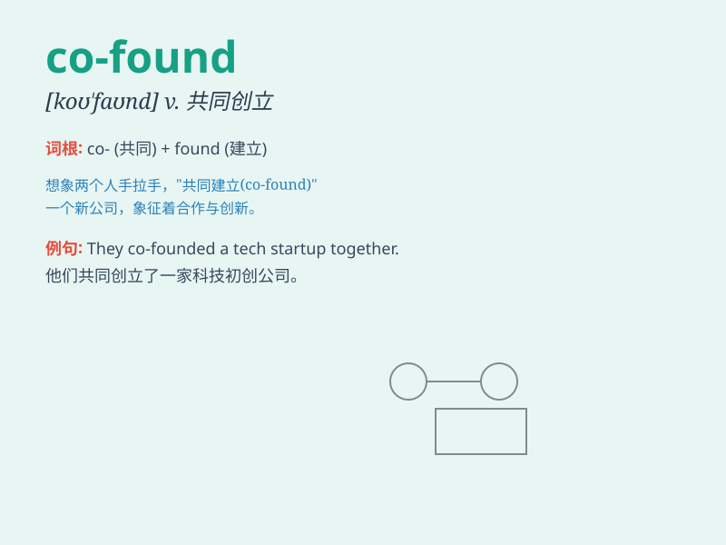

## co-found

**英音:** _[kəʊˈfaʊnd]_ **美音:** _[koʊˈfaʊnd]_

**译义:** *v.共同创立（公司、组织等）*

### 短语

+ **co-found a company:** _共同创立一家公司_

+ **co-found an organization:** _共同创建一个组织_

+ **co-found a project:** _共同发起一个项目_

+ **co-found a startup:** _共同创办一家创业公司_

+ **co-found a charity:** _共同创建一个慈善机构_

### 例句

#### 例句1

> **They co-founded a successful startup company last year.**

**中文翻译:** 他们去年共同创立了一家成功的创业公司。

**单词释义:** 共同创立

#### 例句2

> **The two friends decided to co-found a charity organization to
help the poor.**

**中文翻译:** 这两个朋友决定共同创办一个慈善组织来帮助穷人。

**单词释义:** 共同创办

#### 例句3

> **She and her partner co-founded a new school for special needs
children.**

**中文翻译:** 她和她的搭档共同为有特殊需求的儿童创办了一所新学校。

**单词释义:** 共同创办

### 背诵小故事

>
想象一下，两位勇敢的创业者小明和小红，他们决定携手共同创办一家创新的科技公司。这个共同创办的动作就是\'co-found\'，他们一起努力，为实现梦想迈出了重要的第一步。

**想象两位创业者共同创办公司的情景来记住\'co-found\'（共同创办）这个单词**

### 图义

