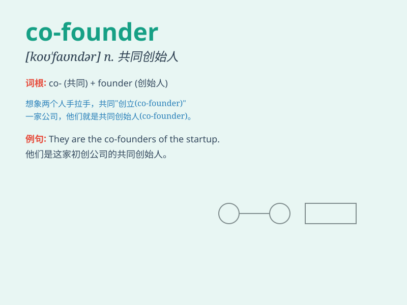

## co-founder

**英音:** _[ˌkəʊ ˈfaʊndə(r)]_ **美音:** _[ˌkoʊ
ˈfaʊndər]_

**译义:** *n.共同创立者，共同创始人*

### 短语

+ **co-founder partner:** _联合创始人伙伴_

+ **co-founder relationship:** _联合创始人关系_

+ **co-founder agreement:** _联合创始人协议_

+ **co-founder team:** _联合创始人团队_

+ **co-founder spirit:** _联合创始人精神_

### 例句

#### 例句1

> **He is one of the co-founders of this successful startup.**

**中文翻译:** 他是这家成功的创业公司的联合创始人之一。

**单词释义:** 联合创始人

#### 例句2

> **The co-founders had a shared vision for the company\'s
future.**

**中文翻译:** 联合创始人们对公司的未来有着共同的愿景。

**单词释义:** 联合创始人

#### 例句3

> **She met the co-founders at a business conference.**

**中文翻译:** 她在一次商务会议上见到了联合创始人。

**单词释义:** 联合创始人

### 背诵小故事

> 想象一下，小明和小李共同创办了一家科技公司。他们就是这家公司的
co-founders。小明有技术，小李懂市场，两人携手合作，共同奠定了公司的基础。

**想象一下，小明和小李共同创办了一家科技公司。他们就是这家公司的共同创始人。小明有技术，小李懂市场，两人携手合作，共同奠定了公司的基础。**

### 图义

