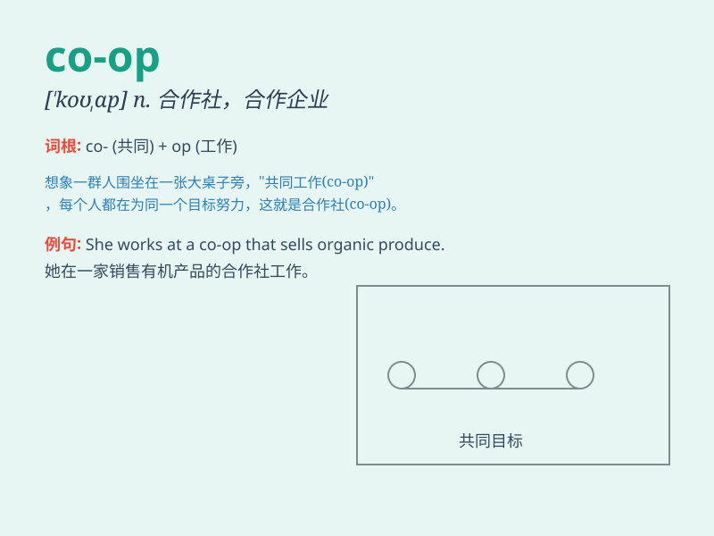

## co-op

**英音:** _[koʊˈɒp]_ **美音:** _[koʊˈɑp]_

**译义:** *n.合作社，合作商店；合作公寓adj.合作的*

### 短语

+ **co-op apartment:** _合作公寓_

+ **co-op store:** _合作商店_

+ **student co-op:** _学生合作社_

+ **housing co-op:** _住房合作社_

+ **consumer co-op:** _消费者合作社_

### 例句

#### 例句1

> **I live in a co-op apartment building.**

**中文翻译:** 我住在一个合作公寓楼里。

**单词释义:** 合作公寓

#### 例句2

> **The local food co-op provides fresh produce at reasonable
prices.**

**中文翻译:** 当地的食品合作社以合理的价格提供新鲜农产品。

**单词释义:** 合作社

#### 例句3

> **She got a job at the co-op store.**

**中文翻译:** 她在合作社商店找到了一份工作。

**单词释义:** 合作社

### 背诵小故事

> A group of friends decided to start a business together. They chose
to form a \'co-op\'. They shared the costs, risks, and profits equally.
Through teamwork and mutual support, their co-op became successful.

**一群朋友决定一起创业。他们选择成立一个'合作社'。他们平均分担成本、风险和利润。通过团队合作和相互支持，他们的合作社取得了成功。**

### 图义

