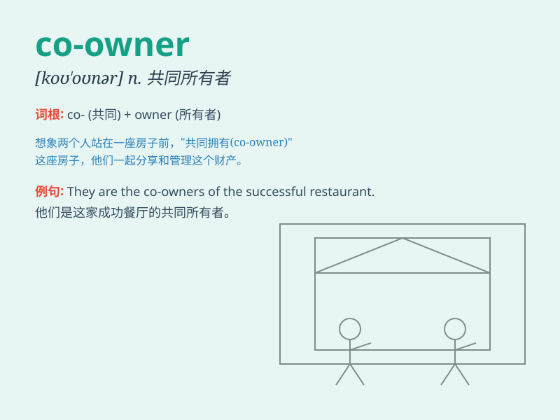

## co-owner

**英音:** _[ˌkəʊˈəʊnə(r)]_ **美音:** _[ˌkoʊˈoʊnər]_

**译义:** *n.共同所有人；共有人*

### 短语

+ **co-owner of a business:** _企业的共同所有者_

+ **co-owner of a property:** _房产的共同所有者_

+ **co-owner of a company:** _公司的共同所有者_

+ **co-owner of a vehicle:** _车辆的共同所有者_

+ **co-owner of a patent:** _专利的共同所有者_

### 例句

#### 例句1

> **John and Mary are the co-owners of the house.**

**中文翻译:** 约翰和玛丽是这所房子的共同所有者。

**单词释义:** 共同所有者

#### 例句2

> **The company has two co-owners who share equal responsibility.**

**中文翻译:** 这家公司有两个共同所有者，他们承担同等责任。

**单词释义:** 共同所有者

#### 例句3

> **They became co-owners of the business after a successful
partnership.**

**中文翻译:** 在一次成功的合作之后，他们成为了这家企业的共同所有者。

**单词释义:** 共同所有者

### 背诵小故事

> Once upon a time, there was a beautiful house. Tom and Jerry became
co-owners. They shared the responsibility and joy of owning it together.
They made decisions and took care of it as a team.

**从前，有一座漂亮的房子。汤姆和杰瑞成为了共同所有者。他们共同承担责任，一起享受拥有它的快乐。他们作为一个团队做决定并照料它。**

### 图义

