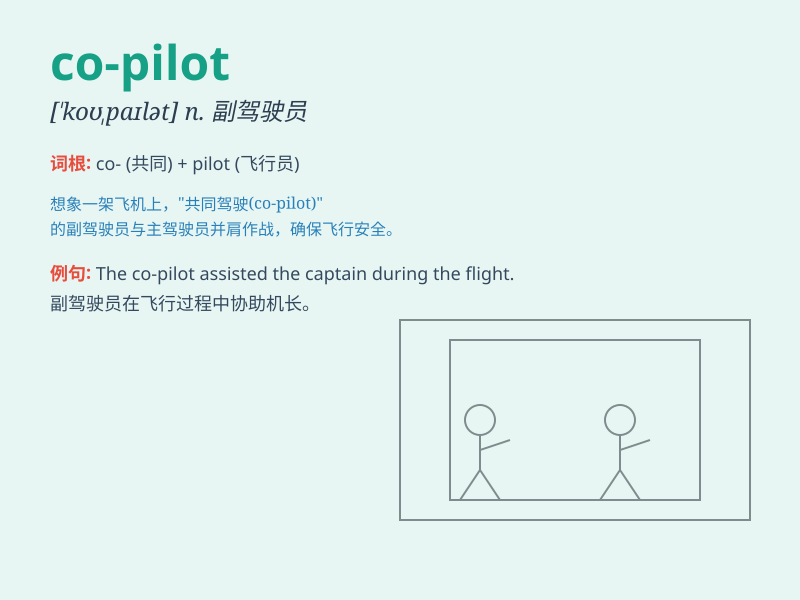

## co-pilot

**英音:** _[ˌkəʊˈpaɪlət]_ **美音:** _[ˌkoʊˈpaɪlət]_

**译义:** *n. 副驾驶员；副飞行员；辅助驾驶员*

### 短语

+ **co-pilot seat:** _副驾驶座位_

+ **experienced co-pilot:** _经验丰富的副驾驶_

+ **co-pilot training:** _副驾驶培训_

+ **emergency co-pilot:** _紧急副驾驶_

+ **co-pilot duties:** _副驾驶职责_

### 例句

#### 例句1

> **The co-pilot assisted the pilot during the difficult landing.**

**中文翻译:** 副驾驶在艰难的着陆过程中协助了飞行员。

**单词释义:** 副驾驶

#### 例句2

> **The co-pilot took over the controls when the pilot became
ill.**

**中文翻译:** 当飞行员生病时，副驾驶接管了控制。

**单词释义:** 副驾驶

#### 例句3

> **The experienced co-pilot provided valuable advice to the novice
pilot.**

**中文翻译:** 经验丰富的副驾驶给新手飞行员提供了宝贵的建议。

**单词释义:** 副驾驶

### 背诵小故事

> One day, a plane was flying through the sky. The pilot was feeling
ill. Luckily, there was a co-pilot who took over and safely landed the
plane. The co-pilot was the partner and helper of the main pilot.

**有一天，一架飞机在空中飞行。飞行员感觉不舒服。幸运的是，有一位副驾驶接管并安全降落了飞机。副驾驶是主飞行员的搭档和助手。**

### 图义

