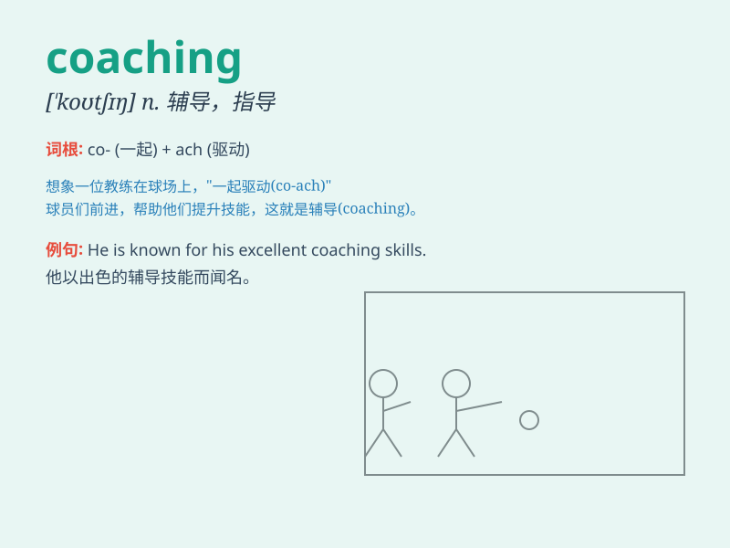

## coaching

**英音:** _[ˈkəʊtʃɪŋ]_ **美音:** _[ˈkoʊtʃɪŋ]_

**译义:** *n.辅导；训练；长途客车服务；adj.教练的；训练的*

### 短语

+ **life coaching:** _人生指导_

+ **executive coaching:** _高管辅导_

+ **career coaching:** _职业辅导_

+ **performance coaching:** _绩效辅导_

+ **team coaching:** _团队辅导_

### 例句

#### 例句1

> **I signed up for coaching sessions to improve my public speaking
skills.**

**中文翻译:** 我报名参加了辅导课程以提高我的公开演讲技能。

**单词释义:** 辅导；指导

#### 例句2

> **The coaching staff is responsible for training the athletes.**

**中文翻译:** 教练组负责训练运动员。

**单词释义:** 教练；训练

#### 例句3

> **She received career coaching and landed a great job.**

**中文翻译:** 她接受了职业指导并找到了一份好工作。

**单词释义:** 指导；建议

### 背诵小故事

> A young athlete was struggling in the race. But with the patient
coaching of an experienced coach, he improved greatly. The coach\'s
advice and encouragement were like guiding lights.

**一位年轻运动员在比赛中表现挣扎。但在一位经验丰富的教练的耐心指导下，他进步巨大。教练的建议和鼓励就像指路明灯。**

### 图义

