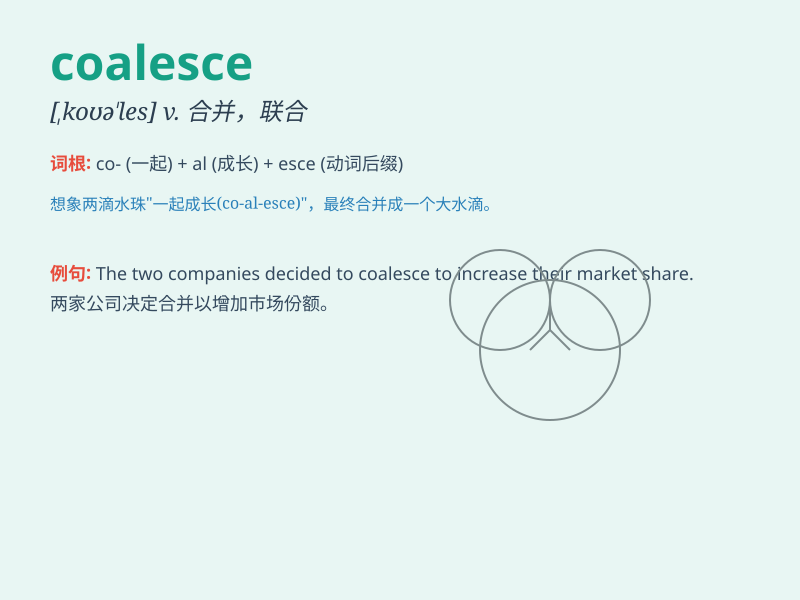

## coalesce

**英音:** _[,kəʊə\'les]_ **美音:** _[,koə\'lɛs]_

**译义:** *v.接合*

### 短语

+ **coalesce into:** _合并成；融合成_

+ **coalesce with:** _与\...\...合并；与\...\...融合_

+ **begin to coalesce:** _开始合并；开始融合_

+ **coalesce gradually:** _逐渐合并；逐渐融合_

+ **coalesce completely:** _完全合并；完全融合_

### 例句

#### 例句1

> **The clouds coalesced into a single mass.**

**中文翻译:** 云聚集成了一团。

**单词释义:** 合并；联合；结合

#### 例句2

> **The two companies coalesced to form a new entity.**

**中文翻译:** 这两家公司合并形成了一个新的实体。

**单词释义:** 合并；联合

#### 例句3

> **The opinions of the group coalesced around a common solution.**

**中文翻译:** 小组的意见围绕一个共同的解决方案聚合起来。

**单词释义:** 聚合；融合

### 背诵小故事

> A group of small clouds coalesce to form a big cloud. At first, they
were separate, but gradually they came together and merged. Just like
the meaning of \'coalesce\', which is to come together and combine.

**一群小云朵合并形成了一大片云。起初，它们是分散的，但逐渐地它们聚集到一起并融合。这就像\'coalesce\'这个词的意思，即联合、合并。**

### 图义

