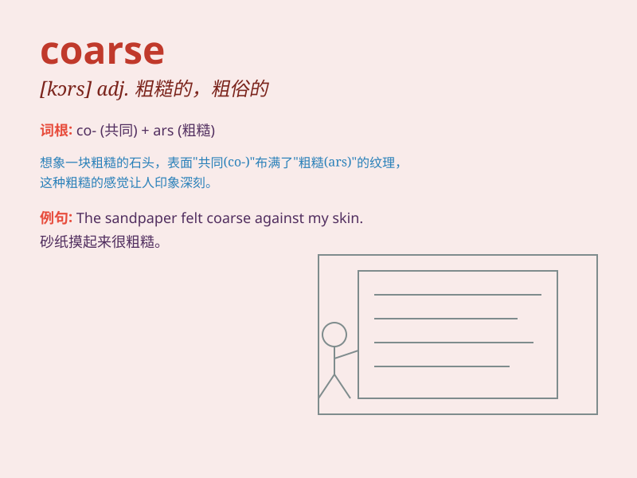

## coarse

**英音:** _[kɔːs]_ **美音:** _[kɔrs]_

**译义:** *adj.粗糙的,粗鄙的*

### 短语

+ **coarse language:** _粗俗的语言_

+ **coarse sand:** _粗砂_

+ **coarse texture:** _粗糙的质地_

+ **coarse hair:** _粗硬的头发_

+ **coarse food:** _粗劣的食物_

### 例句

#### 例句1

> **The fabric of this shirt is coarse and uncomfortable.**

**中文翻译:** 这件衬衫的布料粗糙且不舒服。

**单词释义:** 粗糙的

#### 例句2

> **His coarse language shocked everyone at the party.**

**中文翻译:** 他粗俗的语言让聚会上的每个人都感到震惊。

**单词释义:** 粗俗的

#### 例句3

> **The sand on this beach is coarse and not suitable for making
sandcastles.**

**中文翻译:** 这个海滩上的沙子很粗糙，不适合堆沙堡。

**单词释义:** 粗糙的

### 背诵小故事

> A traveler was lost in a forest. The path was coarse, full of big
stones and prickly bushes. It was so rough that it made the traveler\'s
journey very difficult. \'Coarse\' means rough and not fine or smooth.

**一位旅行者在森林中迷路了。道路很粗糙，到处都是大石头和带刺的灌木丛。它非常粗糙，使得旅行者的旅程十分艰难。\'coarse\'意思是粗糙的，不精细或不光滑的。**

### 图义

