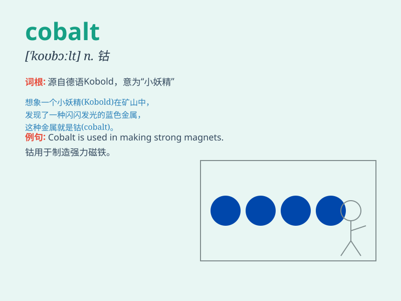

## cobalt

**英音:** _[\'kəʊbɔːlt; -ɒlt]_ **美音:** _[\'kobɔlt]_

**译义:** *n.[化]钴(符号为Co),钴类颜料,由钴制的深蓝色*

### 短语

+ **cobalt blue:** _钴蓝色_

+ **cobalt oxide:** _氧化钴_

+ **cobalt chloride:** _氯化钴_

+ **cobalt alloy:** _钴合金_

+ **cobalt steel:** _钴钢_

### 例句

#### 例句1

> **The cobalt blue of the sky was breathtaking.**

**中文翻译:** 天空的钴蓝色令人叹为观止。

**单词释义:** 钴蓝色

#### 例句2

> **Cobalt is used in the production of alloys.**

**中文翻译:** 钴用于合金的生产。

**单词释义:** 钴（元素）

#### 例句3

> **The artist mixed cobalt with other pigments to create a unique
shade.**

**中文翻译:** 这位艺术家将钴与其他颜料混合以创造出独特的色调。

**单词释义:** 钴（颜料）

### 背诵小故事

> A brave miner was exploring a deep cave. Suddenly, he discovered a
shiny blue mineral, which was cobalt. He knew it was valuable and
brought it back to the surface, making a fortune.

**一位勇敢的矿工正在探索一个深洞。突然，他发现了一种闪亮的蓝色矿物，这就是钴。他知道它很有价值，便把它带回了地面，发了大财。**

### 图义

