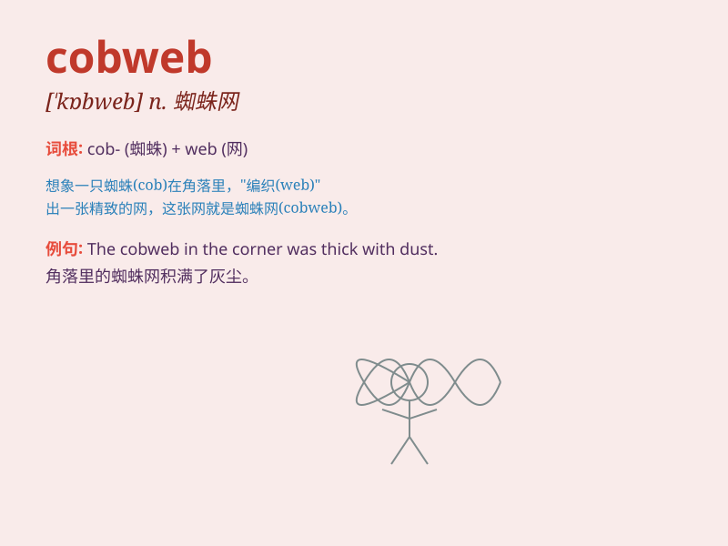

## cobweb

**英音:** _[\'kɒbweb]_ **美音:** _[\'kɑb\'wɛb]_

**译义:** *n.蜘蛛网,蛛丝*

### 短语

+ **cobweb theory:** _蛛网理论_

+ **cobweb model:** _蛛网模型_

+ **cobweb effect:** _蛛网效应_

+ **cobweb corner:** _蛛网角落_

+ **cobweb thread:** _蜘蛛网丝_

### 例句

#### 例句1

> **The old house was full of cobwebs in the corners.**

**中文翻译:** 这座老房子的角落里布满了蜘蛛网。

**单词释义:** 蜘蛛网

#### 例句2

> **She brushed away the cobwebs from her face.**

**中文翻译:** 她拂去了脸上的蜘蛛网。

**单词释义:** 蜘蛛网

#### 例句3

> **The attic was so dusty and filled with cobwebs.**

**中文翻译:** 阁楼布满灰尘，还到处都是蜘蛛网。

**单词释义:** 蜘蛛网

### 背诵小故事

> One day, a little spider was busy spinning a web. The web it made was
so fine and looked like a beautiful cobweb. When the wind blew, the
cobweb swayed gently. Finally, the cobweb became a masterpiece of the
little spider.

**有一天，一只小蜘蛛正忙着织网。它织的网如此精细，看起来像一张漂亮的蜘蛛网。当风吹来时，蜘蛛网轻轻摇晃。最终，这张蜘蛛网成了小蜘蛛的杰作。**

### 图义

