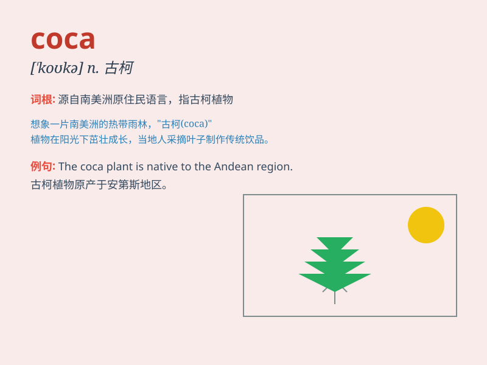

## coca

**英音:** _[\'kəʊkə]_ **美音:** _[\'kokə]_

**译义:**
*n.[植]古柯(南美及西印度群岛所产的一种药用植物),古柯叶*

### 短语

+ **coca leaf:** _古柯叶_

+ **coca extract:** _古柯提取物_

+ **coca plant:** _古柯植物_

+ **coca cultivation:** _古柯种植_

+ **coca trade:** _古柯贸易_

### 例句

#### 例句1

> **The coca plant is native to South America.**

**中文翻译:** 古柯植物原产于南美洲。

**单词释义:** 古柯（植物）

#### 例句2

> **Coca leaves have been used for medicinal purposes for
centuries.**

**中文翻译:** 几个世纪以来，古柯叶一直被用于医疗目的。

**单词释义:** 古柯（植物）

#### 例句3

> **The illegal trade of coca is a serious problem.**

**中文翻译:** 非法的古柯贸易是一个严重的问题。

**单词释义:** 古柯（植物）

### 背诵小故事

> Once upon a time, a little boy was lost in a jungle. He was very
thirsty and finally found a plant called coca. He knew it could help him
quench his thirst. But he also knew he should use it carefully.

**从前，有一个小男孩在丛林里迷路了。他非常口渴，最后发现了一种叫做古柯的植物。他知道它能帮他解渴。但他也知道应该谨慎使用它。**

### 图义

