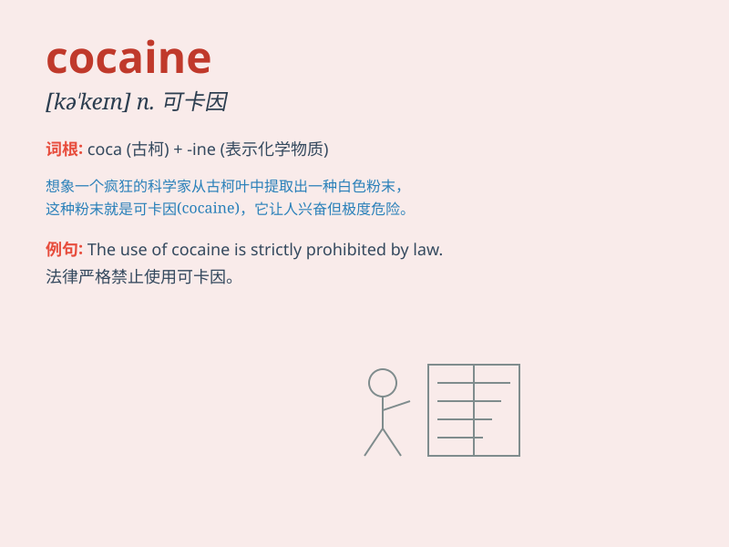

## cocaine

**英音:** _[kə(ʊ)\'keɪn]_ **美音:** _[ko\'ken]_

**译义:** *n.古柯碱,可卡因*

### 短语

+ **cocaine addiction:** _可卡因成瘾_

+ **cocaine trafficking:** _可卡因贩运_

+ **cocaine use:** _使用可卡因_

+ **cocaine abuse:** _可卡因滥用_

+ **cocaine smuggling:** _可卡因走私_

### 例句

#### 例句1

> **He was arrested for possession of cocaine.**

**中文翻译:** 他因持有可卡因而被捕。

**单词释义:** 可卡因

#### 例句2

> **Cocaine is an extremely addictive drug.**

**中文翻译:** 可卡因是一种极易上瘾的毒品。

**单词释义:** 可卡因

#### 例句3

> **She ruined her life by getting involved with cocaine.**

**中文翻译:** 她因沾上可卡因而毁了自己的一生。

**单词释义:** 可卡因

### 背诵小故事

> A detective was on a case involving a criminal gang dealing in
cocaine. One night, he followed a suspect and saw the exchange of white
powder labeled \'cocaine\'. This dangerous drug was ruining lives.

**一位侦探正在处理一个涉及贩卖可卡因的犯罪团伙的案件。一天晚上，他跟踪一名嫌疑人，看到了标有\'可卡因\'的白色粉末的交易。这种危险的毒品正在毁掉人们的生活。**

### 图义

