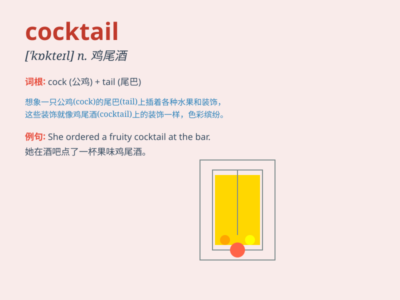

## cocktail

**英音:** _[\'kɒkteɪl]_ **美音:** _[\'kɑktel]_

**译义:** *n.鸡尾酒,(第一道用杯盛的)开味食品adj.鸡尾酒的*

### 短语

+ **cocktail party:** _鸡尾酒会_

+ **cocktail dress:** _鸡尾酒裙；礼服_

+ **fruit cocktail:** _水果鸡尾酒_

+ **cocktail lounge:** _鸡尾酒廊；酒吧间_

+ **cocktail shaker:** _鸡尾酒调酒器_

### 例句

#### 例句1

> **I ordered a cocktail at the bar.**

**中文翻译:** 我在酒吧点了一杯鸡尾酒。

**单词释义:** 鸡尾酒

#### 例句2

> **The cocktail party was a great success.**

**中文翻译:** 这次鸡尾酒会非常成功。

**单词释义:** 鸡尾酒会

#### 例句3

> **She mixed a delicious cocktail for her guests.**

**中文翻译:** 她为客人调制了一杯美味的鸡尾酒。

**单词释义:** 鸡尾酒

### 背诵小故事

>
想象一下，在一个豪华派对上，一只聪明的公鸡（cock）跳上了桌子，尾巴（tail）一甩，打翻了各种酒水，混合出了一杯独特的饮品，这就是鸡尾酒（cocktail）。

**想象在派对上公鸡打翻酒水混合出鸡尾酒的情景来辅助记忆\'cocktail（鸡尾酒）\'这个单词**

### 图义

