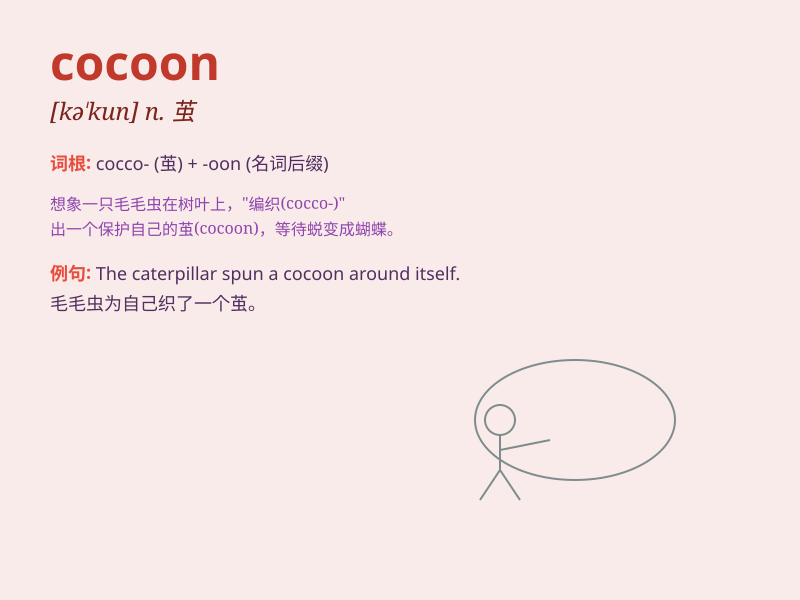

## cocoon

**英音:** _[kə\'kuːn]_ **美音:** _[kə\'kʊn]_

**译义:** *n.茧*

### 短语

+ **silk cocoon:** _蚕茧_

+ **cocoon oneself:** _自我封闭；把自己包裹起来_

+ **cocoon silk:** _茧丝_

+ **break out of the cocoon:** _破茧而出_

+ **cocoon stage:** _茧期_

### 例句

#### 例句1

> **The butterfly emerged from its cocoon.**

**中文翻译:** 蝴蝶从它的茧中出来了。

**单词释义:** 茧

#### 例句2

> **She felt safe and protected in her emotional cocoon.**

**中文翻译:** 她在自己的情感保护壳里感到安全和受到保护。

**单词释义:** 保护壳；防护层

#### 例句3

> **The silkworm spins a cocoon to protect itself during its
transformation.**

**中文翻译:** 蚕在蜕变期间吐丝织茧来保护自己。

**单词释义:** 茧

### 背诵小故事

> A little caterpillar built a cozy home called a cocoon. It stayed
inside for a long time. Then, one day, it emerged as a beautiful
butterfly. The cocoon protected and transformed it.

**一只小毛毛虫建造了一个舒适的家，叫做茧。它在里面待了很长时间。然后，有一天，它变成了一只美丽的蝴蝶。茧保护并改变了它。**

### 图义

