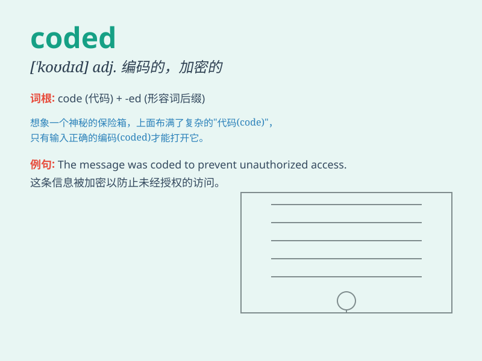

## coded

**英音:** _[ˈkəʊdɪd]_ **美音:** _[ˈkoʊdɪd]_

**译义:** *adj. 编码的；密码的*

### 短语

+ **coded message:** _编码信息_

+ **coded language:** _编码语言_

+ **coded system:** _编码系统_

+ **coded signal:** _编码信号_

+ **coded data:** _编码数据_

### 例句

#### 例句1

> **The message was coded in a secret language.**

**中文翻译:** 这条消息是用一种秘密语言编码的。

**单词释义:** 被编码；被译成密码

#### 例句2

> **The software is coded by our team.**

**中文翻译:** 这个软件是由我们团队编写代码的。

**单词释义:** 编写代码

#### 例句3

> **His actions seemed coded to send a specific message.**

**中文翻译:** 他的行为似乎是经过编码以传递特定的信息。

**单词释义:** 经过编码；被设定

### 背诵小故事

> A spy was sending secret messages. To keep them safe, he coded them.
Each letter was replaced by a special symbol. Only those who knew the
code could understand. It was a risky but smart way to communicate.

**一名间谍正在发送秘密消息。为了保证安全，他对消息进行了编码。每个字母都被一个特殊符号所取代。只有知道编码的人才能理解。这是一种冒险但聪明的交流方式。**

### 图义

