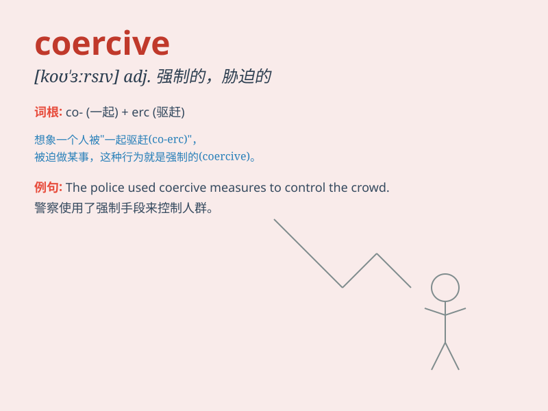

## coercive

**英音:** _[kəʊ\'ɜːsɪv]_ **美音:** _[ko\'ɝsɪv]_

**译义:** *adj.强制的,强迫的*

### 短语

+ **coercive measure:** _强制手段_

+ **coercive power:** _强制权力_

+ **coercive control:** _强制控制_

+ **coercive force:** _强制力_

+ **coercive law:** _强制性法律_

### 例句

#### 例句1

> **The government\'s coercive measures to control the epidemic were
met with some resistance.**

**中文翻译:** 政府控制疫情的强制手段遭到了一些抵制。

**单词释义:** 强制的

#### 例句2

> **She refused to submit to his coercive tactics.**

**中文翻译:** 她拒绝屈服于他的胁迫策略。

**单词释义:** 胁迫的

#### 例句3

> **The law should not rely on coercive powers alone to maintain
order.**

**中文翻译:** 法律不应仅仅依靠强制权力来维持秩序。

**单词释义:** 强制的

### 背诵小故事

> A thief was caught and the police used coercive measures to make him
confess. They were firm and forceful, not giving him any chance to
escape. \'Coercive\' means using force or pressure to make someone do
something.

**一个小偷被抓住了，警察使用强制手段让他招供。他们态度坚决且强硬，不给他任何逃跑的机会。'coercive'意思是使用武力或压力迫使某人做某事。**

### 图义

