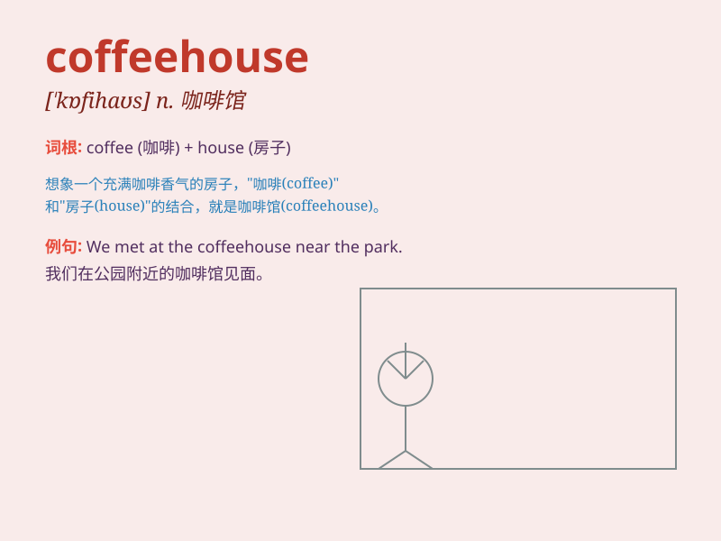

## coffeehouse

**英音:** _[ˈkɒfihaʊs]_ **美音:** _[ˈkɔːfihaʊs]_

**译义:** *n.咖啡馆，咖啡屋*

### 短语

+ **visit a coffeehouse:** _参观一家咖啡馆_

+ **work in a coffeehouse:** _在咖啡馆工作_

+ **frequent a coffeehouse:** _常去一家咖啡馆_

+ **open a coffeehouse:** _开一家咖啡馆_

+ **decorate a coffeehouse:** _装饰一家咖啡馆_

### 例句

#### 例句1

> **I often meet my friends at the local coffeehouse to chat.**

**中文翻译:** 我经常在当地的咖啡馆和朋友们见面聊天。

**单词释义:** 咖啡馆

#### 例句2

> **The coffeehouse near my office has the best espresso.**

**中文翻译:** 我办公室附近的那家咖啡馆有最好的浓缩咖啡。

**单词释义:** 咖啡馆

#### 例句3

> **She spends her weekends reading in the cozy coffeehouse.**

**中文翻译:** 她周末在舒适的咖啡馆里看书。

**单词释义:** 咖啡馆

### 背诵小故事

> One day, I was really tired and needed a break. I walked into a
coffeehouse. There was a cozy corner with soft music. I ordered a cup of
coffee and felt so relaxed. The coffeehouse became my favorite place to
unwind.

**有一天，我非常累，需要休息一下。我走进一家咖啡馆。那里有个舒适的角落，放着轻柔的音乐。我点了一杯咖啡，感觉非常放松。这家咖啡馆成了我最喜欢的放松之地。**

### 图义

