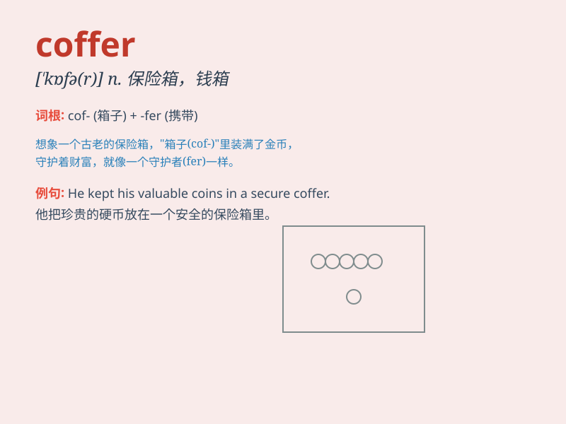

## coffer

**英音:** _[\'kɒfə]_ **美音:** _[\'kɔfɚ]_

**译义:** *n.保险箱*

### 短语

+ **coffer dam:** _围堰；潜水箱_

+ **treasury coffer:** _国库；金库_

+ **coffer ceiling:** _藻井_

+ **stone coffer:** _石棺_

+ **coffer chamber:** _保险箱室_

### 例句

#### 例句1

> **The treasure was hidden in a coffer in the castle.**

**中文翻译:** 宝藏被藏在城堡的一个保险箱里。

**单词释义:** 保险箱；金库

#### 例句2

> **She opened the coffer to take out her jewelry.**

**中文翻译:** 她打开保险箱，取出珠宝。

**单词释义:** 保险箱

#### 例句3

> **The king\'s coffer was filled with gold and precious stones.**

**中文翻译:** 国王的金库里装满了黄金和宝石。

**单词释义:** 金库

### 背诵小故事

> The king stored his treasures in a big coffer. One day, a thief tried
to steal it but was caught. The coffer was so heavy that it needed
several people to move.

**国王把他的财宝存放在一个大保险箱里。有一天，一个小偷试图偷走它，但被抓住了。这个保险箱太重了，需要好几个人才能搬动。**

### 图义

