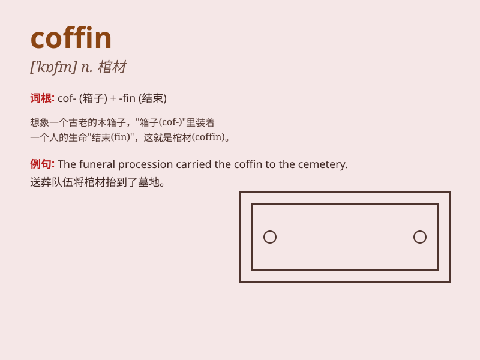

## coffin

**英音:** _[\'kɒfɪn]_ **美音:** _[\'kɔfɪn]_

**译义:** *n.棺材*

### 短语

+ **coffin nail:** _香烟（俚语）_

+ **coffin chamber:** _墓室_

+ **coffin bone:** _（马等的）蹄骨_

+ **coffin ship:** _临近报废的船_

+ **lower the coffin:** _放下棺材_

### 例句

#### 例句1

> **The coffin was carried to the cemetery by pallbearers.**

**中文翻译:** 棺材由抬棺人抬往墓地。

**单词释义:** 棺材

#### 例句2

> **He made a beautiful coffin for his late wife.**

**中文翻译:** 他为已故的妻子制作了一口漂亮的棺材。

**单词释义:** 棺材

#### 例句3

> **The old man prepared his own coffin before his death.**

**中文翻译:** 老人临终前为自己准备了棺材。

**单词释义:** 棺材

### 背诵小故事

> A brave detective was investigating a mysterious case. In a dark
room, he found a coffin. But when he opened it, there was nothing
inside. It turned out to be a trap set by the criminals. The word
\'coffin\' means a box in which a dead body is placed.

**一位勇敢的侦探在调查一起神秘案件。在一个黑暗的房间里，他发现了一口棺材。但当他打开时，里面什么都没有。原来这是罪犯设下的一个陷阱。单词\'coffin\'的意思是棺材，即放置尸体的箱子。**

### 图义

