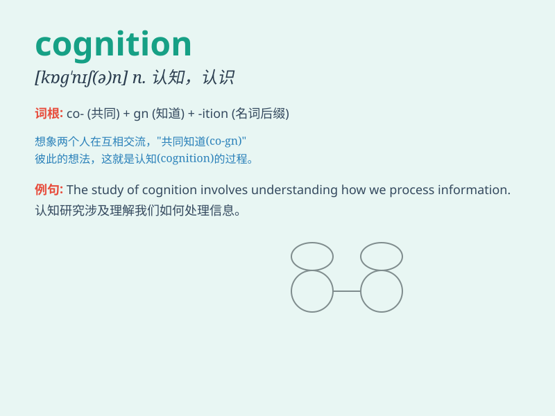

## cognition

**英音:** _[kɒg\'nɪʃ(ə)n]_ **美音:** _[kɑɡ\'nɪʃən]_

**译义:** *n.认识*

### 短语

+ **cognitive psychology:** _认知心理学_

+ **cognitive development:** _认知发展_

+ **cognitive ability:** _认知能力_

+ **cognitive science:** _认知科学_

+ **cognitive impairment:** _认知障碍_

### 例句

#### 例句1

> **The study of cognition helps us understand how the mind processes
information.**

**中文翻译:** 认知研究有助于我们了解大脑如何处理信息。

**单词释义:** 认知；认识

#### 例句2

> **His cognition of the problem was quite limited.**

**中文翻译:** 他对这个问题的认知相当有限。

**单词释义:** 认识；理解

#### 例句3

> **Cognition plays a crucial role in decision-making.**

**中文翻译:** 认知在决策中起着至关重要的作用。

**单词释义:** 认知；认识

### 背诵小故事

> A brave adventurer was lost in a mysterious forest. To find the way
out, he had to use all his cognition. He observed, thought, and
remembered, finally relying on his cognitive skills to return safely.

**一位勇敢的冒险家在神秘森林中迷路了。为了找到出路，他不得不运用他所有的认知能力。他观察、思考、记忆，最终依靠他的认知技能安全返回。**

### 图义

