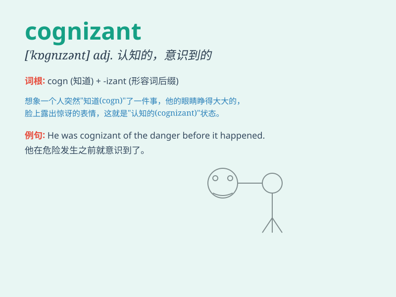

## cognizant

**英音:** _[\'kɒ(g)nɪz(ə)nt]_ **美音:** _[\'kɑgnɪzənt]_

**译义:** *adj.认知的*

### 短语

+ **be cognizant of:** _知道；认识到；意识到_

+ **become cognizant:** _变得知晓；开始认识_

+ **remain cognizant:** _保持知晓；一直意识到_

+ **cognizant awareness:** _认知意识_

+ **fully cognizant:** _完全知晓；充分认识_

### 例句

#### 例句1

> **She was cognizant of the risks involved in the investment.**

**中文翻译:** 她认识到投资所涉及的风险。

**单词释义:** 意识到

#### 例句2

> **The company needs to be cognizant of changes in the market.**

**中文翻译:** 公司需要了解市场的变化。

**单词释义:** 认识到

#### 例句3

> **He became cognizant of his mistake after careful reflection.**

**中文翻译:** 经过认真反思，他认识到了自己的错误。

**单词释义:** 意识到

### 背诵小故事

> A detective was cognizant of all the clues in a mysterious case. He
carefully observed and analyzed, knowing that being cognizant was the
key to solving the puzzle. It means being fully aware or having
knowledge of something.

**一位侦探清楚知晓一起神秘案件的所有线索。他仔细观察和分析，深知有清楚的认知是解开谜团的关键。这个单词意思是意识到或知晓某事。**

### 图义

