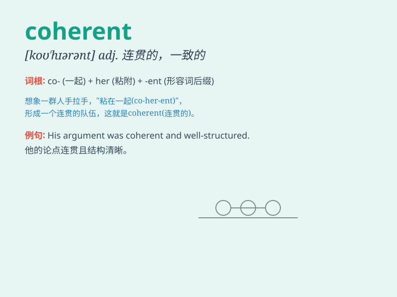

## coherent

**英音:** _[kə(ʊ)\'hɪər(ə)nt]_ **美音:** _[ko\'hɪrənt]_

**译义:** *adj.粘在一起的,一致的,连贯的*

### 短语

+ **coherent argument:** _连贯的论点_

+ **coherent policy:** _连贯一致的政策_

+ **coherent system:** _协调一致的系统_

+ **coherent explanation:** _条理清晰的解释_

+ **coherent plan:** _有条理的计划_

### 例句

#### 例句1

> **The essay was coherent and well-structured.**

**中文翻译:** 这篇文章连贯且结构良好。

**单词释义:** 连贯的；有条理的

#### 例句2

> **She managed to give a coherent explanation of the complex
problem.**

**中文翻译:** 她设法对这个复杂的问题给出了连贯的解释。

**单词释义:** 有条理的；清晰的

#### 例句3

> **The witness\'s testimony was coherent and consistent.**

**中文翻译:** 证人的证词连贯一致。

**单词释义:** 一致的；连贯的

### 背诵小故事

> A detective was trying to solve a complex case. The clues were all
over the place. But then he found some coherent evidence that linked
everything together. Finally, he cracked the case!

**一位侦探试图侦破一起复杂的案件。线索到处都是。但后来他发现了一些连贯的证据，将所有的东西都联系在了一起。最终，他破了案！**

### 图义

