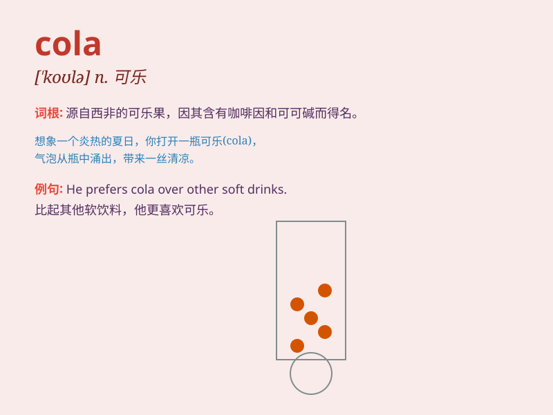

## cola

**英音:** _[\'kəʊlə]_ **美音:** _[\'kolə]_

**译义:** *n.可乐树(其子含咖啡碱),可乐类饮料*

### 短语

+ **cola nut:** _可乐果_

+ **diet cola:** _健怡可乐_

+ **coca-cola:** _可口可乐_

+ **cola flavor:** _可乐味_

+ **cola bottle:** _可乐瓶_

### 例句

#### 例句1

> **I\'d like a bottle of cola.**

**中文翻译:** 我想要一瓶可乐。

**单词释义:** 可乐（一种饮料）

#### 例句2

> **He always drinks cola when he is thirsty.**

**中文翻译:** 他口渴时总是喝可乐。

**单词释义:** 可乐（一种饮料）

#### 例句3

> **The children are crazy about cola.**

**中文翻译:** 孩子们对可乐很着迷。

**单词释义:** 可乐（一种饮料）

### 背诵小故事

> A little monkey was very thirsty. It found a bottle labeled \'cola\'
in a store. After drinking it, it felt so refreshed and energetic. Now
you remember, cola is that drink that can quench thirst.

**一只小猴子非常口渴。它在一家商店里发现了一瓶标有\'cola（可乐）\'的饮料。喝完后，它感到神清气爽、精力充沛。现在你记住了，cola
就是那种能解渴的饮料。**

### 图义

