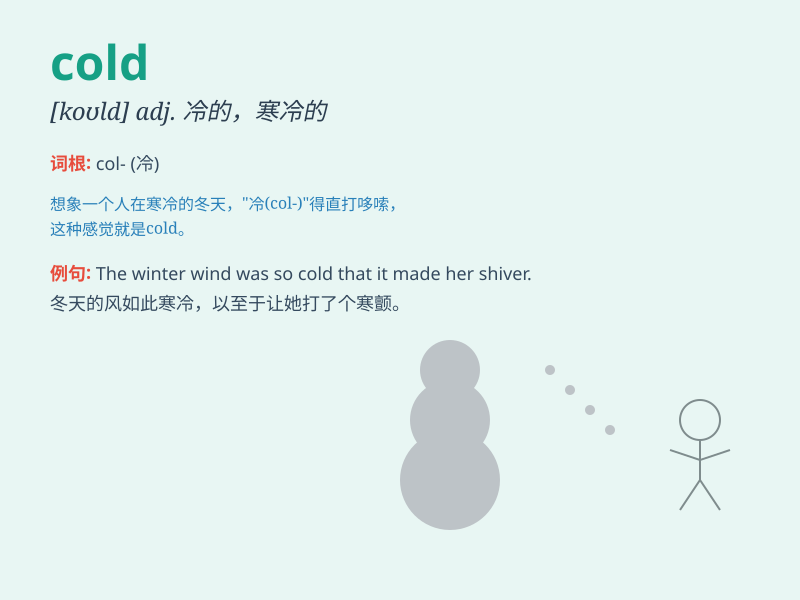

## cold

**英音:** _[kəʊld]_ **美音:** _[kold]_

**译义:**
*n.寒冷,[物]零下温度,伤风,感冒adj.寒冷的,使人战栗的,冷淡的,不热情的,失去知觉的*

### 短语

+ **catch a cold:** _感冒；着凉_

+ **have a cold:** _患感冒_

+ **cold water:** _冷水_

+ **cold weather:** _寒冷的天气_

+ **cold storage:** _冷藏；冷藏库_

### 例句

#### 例句1

> **It\'s very cold outside today.**

**中文翻译:** 今天外面很冷。

**单词释义:** 寒冷的

#### 例句2

> **She gave me a cold look.**

**中文翻译:** 她冷冷地看了我一眼。

**单词释义:** 冷淡的

#### 例句3

> **I have a cold and I feel terrible.**

**中文翻译:** 我感冒了，感觉很糟糕。

**单词释义:** 感冒；伤风

### 背诵小故事

> One cold winter day, a little bird was shivering in the tree. Its
feathers couldn\'t keep it warm. It needed to find a warm place quickly.
Poor thing! This shows how uncomfortable it is when it\'s cold.

**在一个寒冷的冬日，一只小鸟在树上瑟瑟发抖。它的羽毛无法给它保暖。它急需快速找到一个温暖的地方。可怜的小家伙！这展现出寒冷的时候是多么难受。**

### 图义

