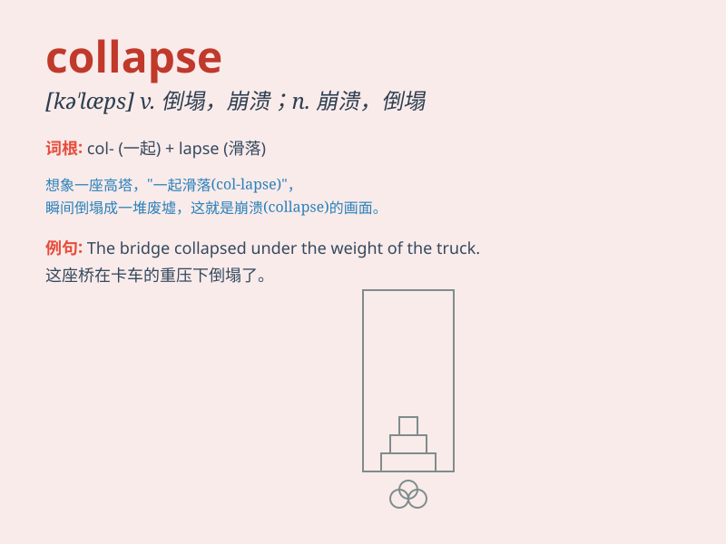

## collapse

**英音:** _[kə\'læps]_ **美音:** _[kə\'læps]_

**译义:** *n.倒塌,崩溃,失败,虚脱vi.倒塌,崩溃,瓦解,失败,病倒*

### 短语

+ **collapse into:** _陷入（某种状态）_

+ **economic collapse:** _经济崩溃_

+ **collapse under:** _因\...\...而垮掉_

+ **structural collapse:** _结构倒塌_

+ **collapse completely:** _完全崩溃_

### 例句

#### 例句1

> **The building collapsed after the earthquake.**

**中文翻译:** 地震后大楼倒塌了。

**单词释义:** 倒塌

#### 例句2

> **He collapsed on the floor from exhaustion.**

**中文翻译:** 他因精疲力尽倒在地板上。

**单词释义:** 倒下；昏倒

#### 例句3

> **The economy collapsed and many people lost their jobs.**

**中文翻译:** 经济崩溃，许多人失业。

**单词释义:** 崩溃；瓦解

### 背诵小故事

> A man was working hard to build a tower of blocks. But suddenly, the
bottom blocks gave way and the whole tower collapse. It was like
everything just fell apart in an instant.

**一个男人正在努力搭建积木塔。但突然，底部的积木垮掉了，整个塔都坍塌了。就好像一切瞬间分崩离析。**

### 图义

