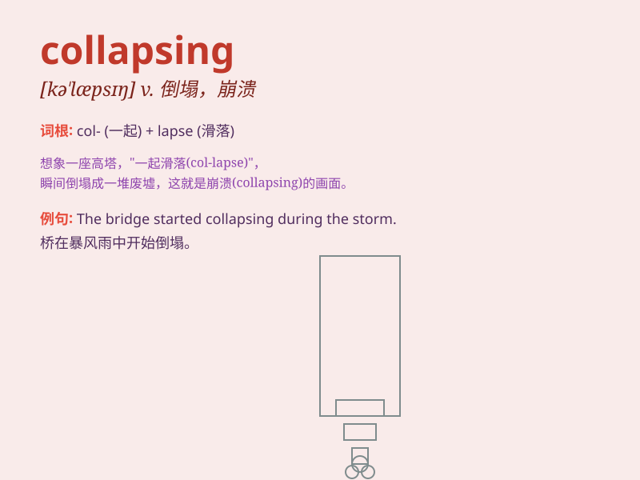

## collapsing

**英音:** _[kəˈlæpsɪŋ]_ **美音:** _[kəˈlæpsɪŋ]_

**译义:**
*v.（突然）倒塌，坍塌；（尤指因病重而）倒下，昏倒；（工作劳累后）坐下，躺下放松；折叠；崩溃，瓦解；（货币）贬值*

### 短语

+ **collapsing star:** _坍缩星_

+ **collapsing building:** _倒塌的建筑物_

+ **collapsing market:** _崩溃的市场_

+ **collapsing bridge:** _坍塌的桥梁_

+ **collapsing economy:** _衰退的经济_

### 例句

#### 例句1

> **The bridge is in danger of collapsing.**

**中文翻译:** 这座桥有倒塌的危险。

**单词释义:** 倒塌

#### 例句2

> **He felt as if his world was collapsing around him.**

**中文翻译:** 他感觉自己的世界正在他周围崩塌。

**单词释义:** 崩塌

#### 例句3

> **The economy is collapsing due to the pandemic.**

**中文翻译:** 由于这场大流行病，经济正在崩溃。

**单词释义:** 崩溃

### 背诵小故事

> A brave explorer was in a cave. Suddenly, the ceiling started
collapsing. Stones and dirt fell all around. The explorer had to run
fast to escape. \'Collapsing\' means falling down or breaking apart
suddenly.

**一位勇敢的探险家在洞穴里。突然，洞顶开始坍塌。石头和泥土四处掉落。探险家不得不快速逃跑。'collapsing'意思是突然倒下或破裂。**

### 图义

