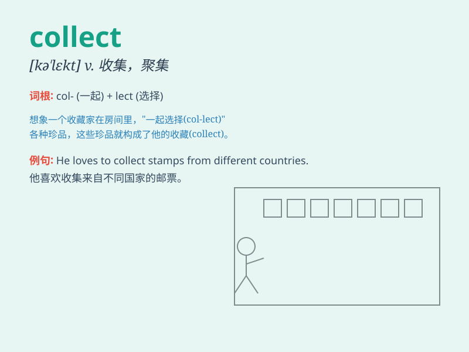

## collect

**英音:** _[kə\'lekt]_ **美音:** _[kə\'lɛkt]_

**译义:**
*v.收集,聚集,集中,搜集adj.由收件人付款的adv.由收件人付款地*

### 短语

+ **collect stamps:** _集邮_

+ **collect money:** _筹钱_

+ **collect data:** _收集数据_

+ **collect oneself:** _镇定下来_

+ **collect call:** _对方付费电话_

### 例句

#### 例句1

> **I collect stamps as a hobby.**

**中文翻译:** 我收集邮票是一种爱好。

**单词释义:** 收集

#### 例句2

> **The dustmen collect the rubbish once a week.**

**中文翻译:** 清洁工每周收集一次垃圾。

**单词释义:** 收集；收取

#### 例句3

> **She came to collect her children from school.**

**中文翻译:** 她来学校接孩子们。

**单词释义:** 接走；领取

### 背诵小故事

> One day, Tom decided to collect stamps. He went to different places,
met many people, and carefully chose each stamp. Finally, he had a
wonderful collection. Remember, collect means to gather or bring things
together.

**有一天，汤姆决定收集邮票。他去了不同的地方，见了很多人，并精心挑选每一张邮票。最后，他有了很棒的收藏。记住，collect
意思是收集、聚集物品。**

### 图义

