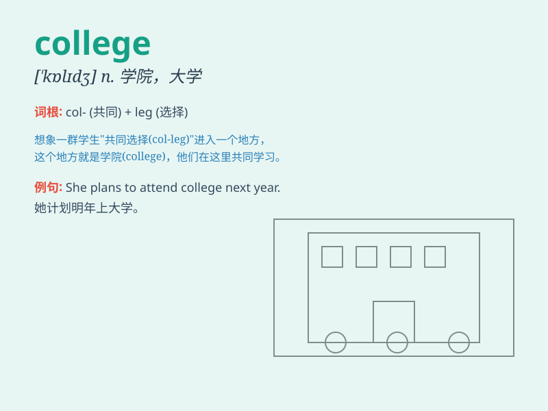

## college

**英音:** _[\'kɒlɪdʒ]_ **美音:** _[\'kɑlɪdʒ]_

**译义:**
*n.(综合大学中的)学院,(独立的)学院,\<美>大学,\<英>公学,书院,高等专科学院,大学,学会*

### 短语

+ **college student:** _大学生_

+ **college degree:** _大学学位_

+ **community college:** _社区学院_

+ **junior college:** _专科学校_

+ **college campus:** _大学校园_

### 例句

#### 例句1

> **She is studying at a prestigious college.**

**中文翻译:** 她正在一所著名大学学习。

**单词释义:** 学院；大学

#### 例句2

> **After graduating from high school, he entered college.**

**中文翻译:** 高中毕业后，他进入了大学。

**单词释义:** 大学

#### 例句3

> **The college offers a wide range of courses.**

**中文翻译:** 学院提供广泛的课程。

**单词释义:** 学院

### 背诵小故事

> One day, a young student named Tom dreamed of entering a college. He
studied hard and finally achieved his goal. In college, he met many
friends and learned a lot of knowledge. College was like a magical place
for him to grow and explore.

**一天，一个叫汤姆的年轻学生梦想着进入大学。他努力学习，最终实现了目标。在大学里，他结识了很多朋友，学到了很多知识。大学对他来说就像一个神奇的地方，供他成长和探索。**

### 图义

