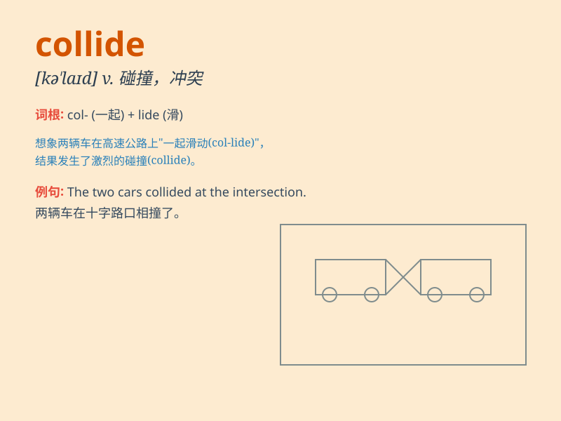

## collide

**英音:** _[kə\'laɪd]_ **美音:** _[kə\'laɪd]_

**译义:** *vi.碰撞,抵触*

### 短语

+ **collide with:** _与\...碰撞；与\...冲突_

+ **collide head-on:** _迎头相撞_

+ **collide violently:** _猛烈碰撞_

+ **collide accidentally:** _意外碰撞_

+ **collide in opinion:** _意见冲突_

### 例句

#### 例句1

> **The two cars collided at the intersection.**

**中文翻译:** 两辆车在路口相撞。

**单词释义:** 碰撞

#### 例句2

> **The interests of the two groups collided, causing a conflict.**

**中文翻译:** 两个群体的利益发生冲突，引发了冲突。

**单词释义:** 冲突；抵触

#### 例句3

> **The football player collided with his opponent and fell to the
ground.**

**中文翻译:** 足球运动员与对手相撞并摔倒在地。

**单词释义:** 相撞

### 背诵小故事

> One day, two cars were driving fast on the road. Suddenly, they lost
control and collided with each other. There was a loud crash and both
cars were damaged. \'Collide\' means to hit each other forcefully.

**有一天，两辆汽车在路上快速行驶。突然，它们失控并相互碰撞。发出一声巨响，两辆车都受损了。'collide'意思是猛烈地相互撞击。**

### 图义

