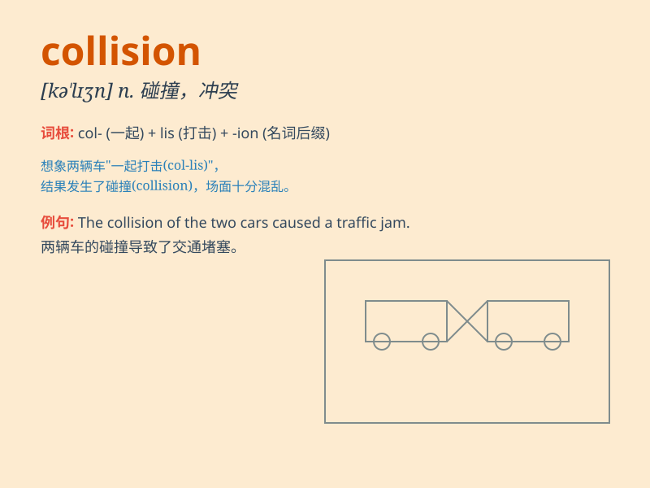

## collision

**英音:** _[kə\'lɪʒ(ə)n]_ **美音:** _[kə\'lɪʒən]_

**译义:** *n.碰撞,冲突*

### 短语

+ **head-on collision:** _正面碰撞；迎头相撞_

+ **collision course:** _碰撞航向；导致冲突的轨迹_

+ **avoid collision:** _避免碰撞_

+ **collision damage:** _碰撞损害_

+ **collision risk:** _碰撞风险_

### 例句

#### 例句1

> **The collision between the two cars caused a lot of damage.**

**中文翻译:** 两辆车相撞造成了很大的损失。

**单词释义:** 碰撞

#### 例句2

> **There was a collision of ideas at the meeting.**

**中文翻译:** 会上发生了思想碰撞。

**单词释义:** 冲突

#### 例句3

> **The satellite was destroyed in a collision with space debris.**

**中文翻译:** 该卫星在与太空碎片的碰撞中被摧毁。

**单词释义:** 碰撞

### 背诵小故事

> One day, two cars were driving fast on the road. Suddenly, they lost
control and had a head-on collision. The sound of the crash was
deafening. It was a terrifying collision.

**有一天，两辆车在路上快速行驶。突然，它们失控并迎头相撞。碰撞的声音震耳欲聋。这是一场可怕的碰撞。**

### 图义

