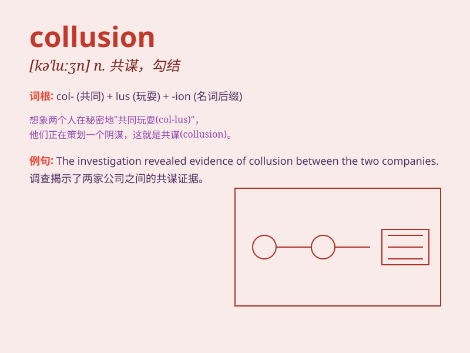

## collusion

**英音:** _[kə\'l(j)uːʒ(ə)n]_ **美音:** _[kə\'lʊʒən]_

**译义:** *n.共谋,勾结*

### 短语

+ **in collusion with:** _与\...勾结；与\...共谋_

+ **collusion among:** _在\...之间勾结_

+ **collusion between:** _在\...之间共谋_

+ **act in collusion:** _协同行动；勾结行事_

+ **suspected collusion:** _涉嫌勾结；被怀疑共谋_

### 例句

#### 例句1

> **The two companies were accused of collusion to fix prices.**

**中文翻译:** 这两家公司被指控共谋操纵价格。

**单词释义:** 共谋；勾结；串通

#### 例句2

> **There is no evidence of collusion between the politicians and the
business leaders.**

**中文翻译:** 没有证据表明政治家和商界领袖之间有勾结。

**单词释义:** 勾结；共谋

#### 例句3

> **The investigation revealed a widespread collusion among the
competitors.**

**中文翻译:** 调查揭示了竞争对手之间广泛的串通行为。

**单词释义:** 串通；共谋

### 背诵小故事

> Two companies were suspected of collusion. They secretly met at night
and planned to fix prices to cheat customers. But their scheme was
exposed. Collusion means secret cooperation for an illegal or dishonest
purpose.

**两家公司被怀疑勾结。他们在晚上秘密会面并计划操纵价格欺骗客户。但他们的阴谋被曝光了。collusion
意思是为非法或不诚实目的进行的秘密合作。**

### 图义

