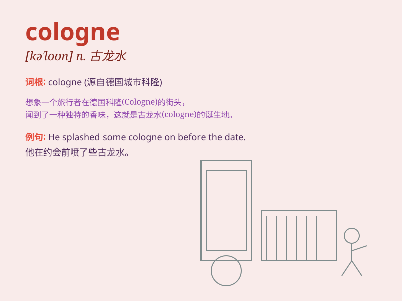

## cologne

**英音:** _[kəˈləʊn]_ **美音:** _[kəˈloʊn]_

**译义:** *n.科隆香水,古龙香人,科隆(或古龙)香锭(或香膏)*

### 短语

+ **cologne water:** _科隆香水；花露水_

+ **fine cologne:** _优质古龙水_

+ **wear cologne:** _喷古龙水；涂抹古龙水_

+ **scent of cologne:** _古龙水的香味_

+ **brand of cologne:** _古龙水品牌_

### 例句

#### 例句1

> **He splashed on some cologne before going on a date.**

**中文翻译:** 他在去约会前喷了些古龙水。

**单词释义:** 古龙水

#### 例句2

> **The smell of cologne filled the room.**

**中文翻译:** 房间里充满了古龙水的气味。

**单词释义:** 古龙水

#### 例句3

> **She bought a new bottle of cologne for her father\'s
birthday.**

**中文翻译:** 她为父亲的生日买了一瓶新的古龙水。

**单词释义:** 古龙水

### 背诵小故事

> One day, while traveling in Europe, I smelled a wonderful fragrance.
A local told me it was cologne. I was immediately charmed by its scent
and remembered the word easily.

**有一天，在欧洲旅行时，我闻到了一股美妙的香味。一位当地人告诉我这是科隆香水。我立刻被它的香气迷住了，轻松记住了这个单词。**

### 图义

