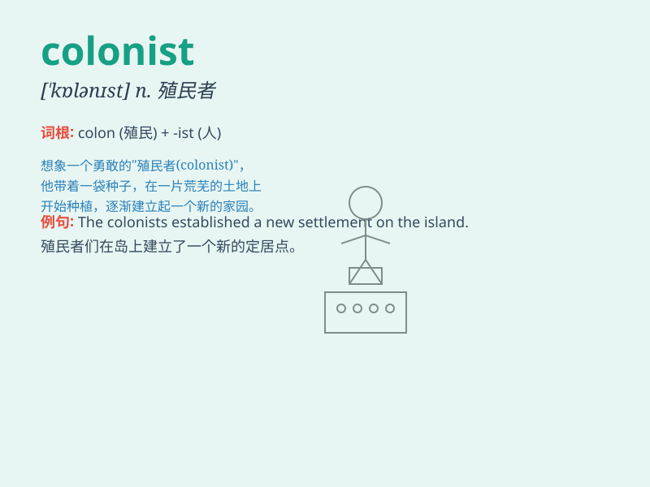

## colonist

**英音:** _[\'kɒlənɪst]_ **美音:** _[\'kɑlənɪst]_

**译义:** *n.殖民地居民,殖民者*

### 短语

+ **British colonist:** _英国殖民者_

+ **early colonist:** _早期殖民者_

+ **native colonist:** _本土殖民者_

+ **colonist settlement:** _殖民者定居点_

+ **colonist expansion:** _殖民者扩张_

### 例句

#### 例句1

> **The colonists came to the new land in search of a better
life.**

**中文翻译:** 这些殖民者来到这片新大陆以寻求更好的生活。

**单词释义:** 殖民者

#### 例句2

> **The Native Americans had conflicts with the colonists over
land.**

**中文翻译:** 美洲原住民和殖民者在土地问题上有冲突。

**单词释义:** 殖民者

#### 例句3

> **The early colonists had to face many hardships and
challenges.**

**中文翻译:** 早期的殖民者不得不面对许多艰难困苦和挑战。

**单词释义:** 殖民者

### 背诵小故事

> Long ago, a group of brave people set off on a journey. They crossed
the ocean and landed on a new land. These people were called colonists.
They started a new life and built a new home there.

**很久以前，一群勇敢的人踏上了旅程。他们穿越海洋，登上了一片新的土地。这些人被称为殖民者。他们在那里开始了新生活并建立了新家园。**

### 图义

