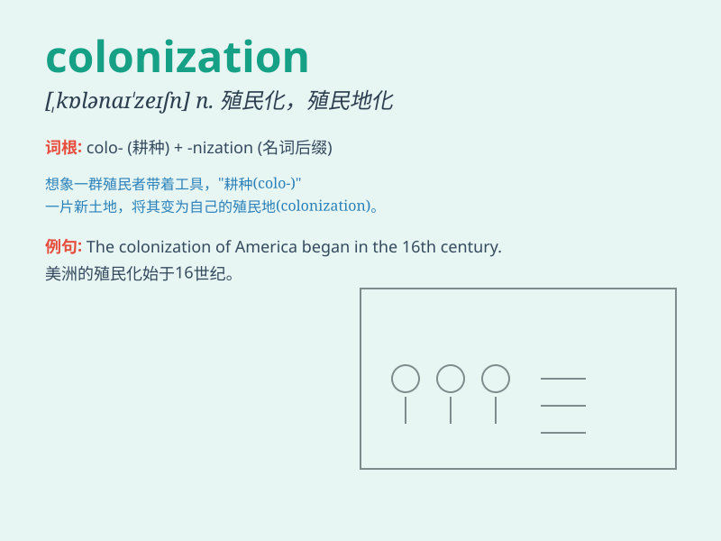

## colonization

**英音:** _[,kɒlənaɪ\'zeɪʃən]_ **美音:**
_[,kɑlənɪ\'zeʃən]_

**译义:** *n.殖民地化,殖民*

### 短语

+ **colonial colonization:** _殖民地的殖民化_

+ **colonization process:** _殖民化进程_

+ **economic colonization:** _经济殖民_

+ **colonization attempt:** _殖民尝试_

+ **forced colonization:** _强迫殖民_

### 例句

#### 例句1

> **The colonization of Africa by European powers had a profound
impact on the continent.**

**中文翻译:** 欧洲列强对非洲的殖民对该大陆产生了深远的影响。

**单词释义:** 殖民

#### 例句2

> **The process of colonization often led to the exploitation of
local resources.**

**中文翻译:** 殖民的过程经常导致对当地资源的开发利用。

**单词释义:** 殖民

#### 例句3

> **The study focuses on the colonization of the Americas in the 16th
century.**

**中文翻译:** 这项研究聚焦于 16 世纪美洲的殖民情况。

**单词释义:** 殖民

### 背诵小故事

> Long ago, a group of brave adventurers set out on a journey. They
reached a new land and started to build houses and farms. This process
of them settling and taking control of the new land was called
colonization.

**很久以前，一群勇敢的冒险者踏上了旅程。他们到达一片新大陆，开始建造房屋和农场。他们这种定居并掌控新土地的过程被称为殖民。**

### 图义

